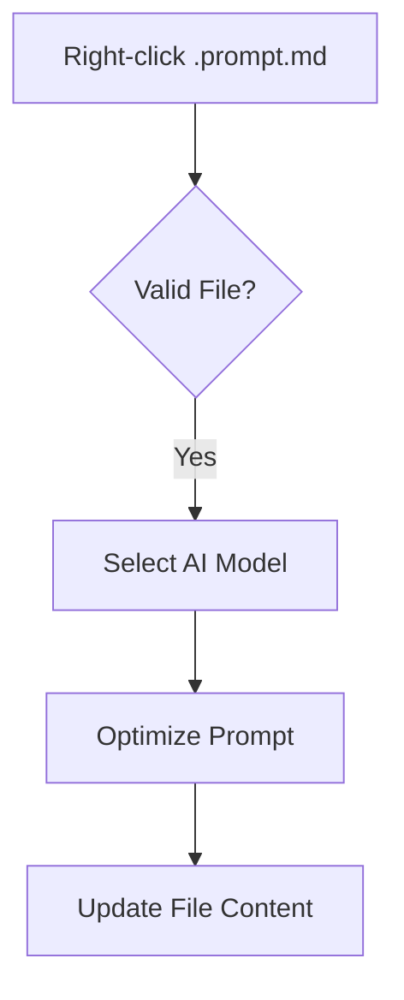
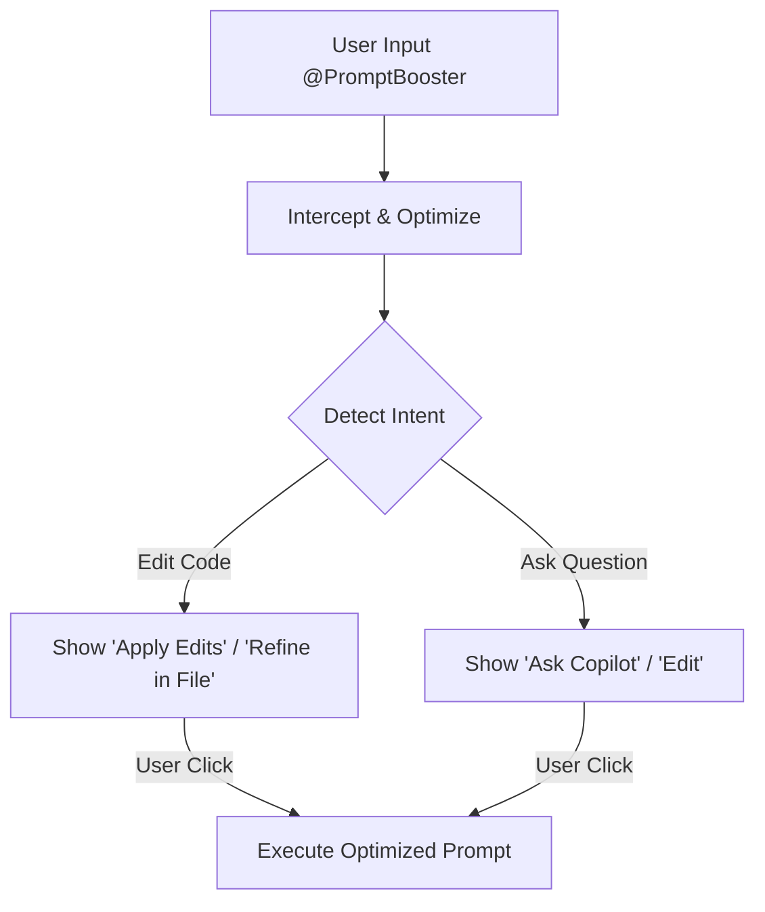
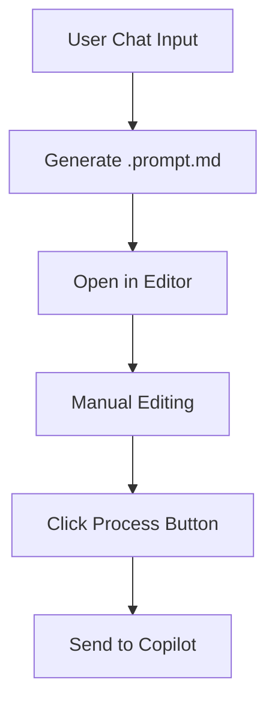

<!-- filepath: /Users/i762309/Documents/tools/prompt-buster/README.md -->

# PromptBooster

A VS Code extension that enhances and optimizes your prompts using AI before sending to GitHub Copilot.

## 🎯 Features

PromptBooster offers three distinct operational modes for different workflow preferences:

### ✅ Mode 1: Manual (File-Based Enhancement)

- **How it works**: Right-click on `.prompt.md` files to enhance them
- **Best for**: Users who want explicit control over when optimization happens
- **Status**: ✅ **FULLY IMPLEMENTED**
- **User actions**:
  - Right-click on any `.prompt.md` file → "PromptBooster: Boost This Prompt"
  - Select text to optimize only the selection
  - Watch progress notification, then see optimized prompt replace original

### ✅ Mode 2: Real-time (Chat Interception with Smart Intent Detection)

- **How it works**: Automatically intercepts chat prompts, enhances them with a structured format, and detects your intent (`ask` vs `edit`).
- **Best for**: Users who want automatic, context-aware optimization with a streamlined workflow.
- **Status**: ✅ **FULLY IMPLEMENTED**
- **User experience**:
  - Type `@PromptBooster your prompt` in Copilot chat
  - The AI structured your prompt into **Task**, **Context**, **Requirements**, and **Output** sections
  - **Smart Intent Detection** determines if you want to *Edit Code* or *Ask a Question*
  - **Dynamic Buttons** based on intent:
    - **Edit Intent**:
      - `$(sparkle) Apply Edits` - Directly run the enhanced prompt
      - `$(edit) Refine in File` - Open `.prompt.md` for manual tweaking
    - **Ask Intent**:
      - `$(comment-discussion) Ask Copilot` - Send question to Copilot
      - `$(edit) Edit` - Tweak the text
  - Always available fallback: `$(reply) Use Original`

### 📝 Mode 3: File Generation (Create & Edit Workflow)

- **How it works**: Generates `.prompt.md` files for manual editing before processing
- **Best for**: Users who prefer full editor capabilities with file persistence
- **Status**: ✅ **FULLY IMPLEMENTED**
- **Features**:
  - Auto-generates `.prompt.md` file with optimized prompt
  - Three naming strategies: timestamp, prompt-based, custom
  - Full editor with syntax highlighting
  - "Process" button and CodeLens to send when ready
  - HTML comments preserve original prompt and instructions
  - Version control friendly storage in `.github/prompts/`

## 🚀 Quick Start

### Installation

1. Install "PromptBooster" from VS Code Extensions
2. Ensure GitHub Copilot extension is installed and active

### Try Mode 1 (Manual)

1. Create a `.prompt.md` file with your prompt:

   ```markdown
   # My Prompt

   Write a function to sort an array
   ```

2. Right-click → "PromptBooster: Boost This Prompt"
3. Watch the prompt get enhanced with more details
4. Use the optimized prompt with Copilot!

### Try Mode 2 (Real-time)

1. Switch to real-time mode:
   - Click status bar (bottom right): `🔧 Manual`
   - Select `⚡ Real-time`

2. Enable auto-optimization (if not already on):
   - `Cmd+Shift+P` → "Toggle Auto-Optimization"

3. Use Copilot chat with `@PromptBooster`:

   ```
   @PromptBooster create a REST API for users
   ```

   or with references:

   ```
   @PromptBooster #selection refactor this code
   ```

4. **Smart Intent Detection**:
   - The extension will automatically detect if you are asking a question or requesting code edits.
   - You will see different buttons based on this detection (e.g., `$(sparkle) Apply Edits` vs `$(comment-discussion) Ask Copilot`).

5. Click the primary button to proceed with the optimized, structured prompt!

### Try Mode 3 (File Generation)

1. Switch to file mode:
   - Click status bar → `📝 File`

2. Use the test command:
   - `Cmd+Shift+P` → "PromptBooster: Test File Generation"
   - File created in `.github/prompts/`
   - Opens automatically for editing

3. Edit the prompt as needed, then:
   - Click "Process Prompt" in status bar, or
   - Use CodeLens button at top of file, or
   - `Cmd+Shift+P` → "PromptBooster: Process Prompt File"

## ⚙️ Configuration

Configure in VS Code Settings (`Cmd+,`):

| Setting               | Default         | Options                           | Description                          |
| --------------------- | --------------- | --------------------------------- | ------------------------------------ |
| `operationMode`       | manual          | manual, realtime, file            | Current operation mode               |
| `autoOptimize`        | false           | true, false                       | Auto-optimize in realtime/file modes |
| `showPreview`         | true            | true, false                       | Show preview before submitting       |
| `fileOutputDirectory` | .github/prompts | any valid path                    | Where to save generated files        |
| `fileNamingPattern`   | prompt          | timestamp, prompt, custom         | File naming strategy                 |
| `modelPreference`     | gpt-4.1         | gpt-4.1, gpt-4o, claude-haiku-4.5 | Preferred AI model                   |

## 📋 Commands

Access via Command Palette (`Cmd+Shift+P`):

- **PromptBooster: Boost This Prompt** - Enhance `.prompt.md` file (Manual Mode)
- **PromptBooster: Switch Operation Mode** - Change between modes
- **PromptBooster: Toggle Auto-Optimization** - Turn auto-optimization on/off
- **PromptBooster: Switch AI Model** - Choose which AI model to use
- **PromptBooster: Configure Permissions** - Manage interception permissions
- **PromptBooster: Process Prompt File** - Process generated `.prompt.md` file (File Mode)
- **PromptBooster: Test File Generation** - Test file generation feature
- **PromptBooster: Test Realtime Mode** - Test realtime mode integration

## 🛠️ Requirements

- **VS Code**: 1.99.0 or higher
- **GitHub Copilot**: Active subscription (for Language Model API access)
- **OS**: macOS, Windows, or Linux
- **Node.js**: 20.x or higher (for development)

## 🎯 What's Implemented

### Phase 1 (Step 1) - ✅ COMPLETE

- ✅ Core infrastructure and configuration system
- ✅ Mode management with [`ModeManager`](src/config/settings.ts)
- ✅ Language model selection with fallback logic
- ✅ Mode 1: Manual prompt enhancement via [`ManualMode`](src/modes/manualMode.ts)
- ✅ Status bar mode switcher via [`ModeStatusBar`](src/ui/modeSelector.ts)
- ✅ Commands registered in [package.json](package.json)
- ✅ Comprehensive error handling
- ✅ Full documentation

### Phase 2 (Step 3) - ✅ COMPLETE

- ✅ Mode 2: Real-time chat interception via [`RealtimeMode`](src/modes/realtimeMode.ts)
- ✅ Chat participant registration (`@PromptBooster`)
- ✅ **Smart Intent Detection** (Ask vs Edit)
- ✅ **Dynamic Context-Aware Buttons**
- ✅ **Structured Prompt Optimization** (Task/Context/Requirements/Output)
- ✅ Chat references support (`#selection`, `#file`, `#editor`)
- ✅ Auto-optimizer with timeout handling
- ✅ Direct AI response streaming (no Copilot forwarding)
- ✅ Optimized prompt saved as markdown file option

### Phase 3 (Step 2) - ✅ COMPLETE

- ✅ Mode 3: File generation via [`FileMode`](src/modes/fileMode.ts)
- ✅ File naming strategies (timestamp, prompt-based, custom)
- ✅ Directory creation and management (`.github/prompts/`)
- ✅ Collision detection and resolution
- ✅ HTML comment preservation for metadata
- ✅ Process button via [`ProcessButton`](src/ui/processButton.ts)
- ✅ CodeLens provider via [`PromptFileCodeLensProvider`](src/ui/processButton.ts)
- ✅ Comment removal before processing
- ✅ File content template with instructions

## 🚀 How It Works

### Manual Mode



### Real-time Mode (Smart Intent)



### File Mode



## 🎨 Status Bar & UI

- **Status bar item** (bottom right): Shows current mode
  - 🔧 Manual Mode - File-based enhancement
  - ⚡ Real-time Mode - Chat interception with preview
  - 📝 File Mode - Generate editable files
- **Click to switch modes** - Opens Quick Pick menu
- **Process button** - Appears in file mode for `.prompt.md` files
- **CodeLens** - "▶️ Process this prompt" at top of `.prompt.md` files
- **Progress notifications** - With cancel button during optimization
- **Output channel** - Detailed logging in "PromptBooster" channel

## 💡 Tips

### For Best Results

1. **Use with complex prompts**: Let PromptBooster add structure and detail
2. **Review in real-time mode**: Learn how prompts are enhanced
3. **Use references**: `#selection`, `#file` provide better context
4. **Check the logs**: `View → Output → PromptBooster` shows what's happening
5. **Try different models**: Use "Switch AI Model" to experiment
6. **Edit before processing**: File mode gives full control

### When to Use Each Mode

| Mode      | When                        | Example                                      |
| --------- | --------------------------- | -------------------------------------------- |
| Manual    | Want full control           | Open prompt file, manually trigger boost     |
| Real-time | Want automatic help         | Type in chat with references, review preview |
| File      | Want to edit before sending | Generate file, refine prompt, then process   |

### File Mode Naming Strategies

| Strategy  | Example Output                         | Best For                  |
| --------- | -------------------------------------- | ------------------------- |
| timestamp | `chat-2026-02-05T14-30-00.prompt.md`   | No collisions, unique IDs |
| prompt    | `create-rest-api.prompt.md`            | Descriptive, readable     |
| custom    | User enters: `my-api-design.prompt.md` | Complete control          |

## 🔗 Links

- [GitHub Repository](https://github.com/sonquach/prompt-buster)
- [GitHub Copilot Extension](https://marketplace.visualstudio.com/items?itemName=GitHub.copilot)
- [VS Code Extension API](https://code.visualstudio.com/api)
- [Language Model API Docs](https://code.visualstudio.com/api/extension-guides/language-model)

## 📄 License

MIT License - Created by Son Quach

## 🐛 Troubleshooting

### "No language model available"

- Ensure GitHub Copilot is installed and active
- Sign in to Copilot with your GitHub account
- Check your Copilot subscription status
- Restart VS Code

### Context menu doesn't appear

- File must end with `.prompt.md` (case-sensitive)
- Save the file before right-clicking
- Reload window: `Developer: Reload Window`

### Real-time mode not working

- Enable auto-optimize: `Cmd+Shift+P` → "Toggle Auto-Optimization"
- Check current mode in status bar (should show ⚡ Real-time)
- Use `@PromptBooster` prefix in chat
- Check Output channel for errors

### File mode not creating files

- Ensure workspace folder is open
- Check `fileOutputDirectory` setting (default: `.github/prompts`)
- Verify write permissions in workspace
- Check Output channel for detailed errors

### Optimization timeout

- Default timeout is 10 seconds
- Complex prompts may need more time
- Extension falls back to original prompt with context
- Check Output channel for "Optimization timed out" message

### Chat references not included

- Use `#selection`, `#file`, or `#editor` in your prompt
- References are automatically extracted and added to context
- Check Output channel for "Including X reference(s)" message
- Verify files are saved before using `#file` reference

See [QUICKSTART.md](QUICKSTART.md) and [REALTIME-MODE-QUICKSTART.md](REALTIME-MODE-QUICKSTART.md) for more troubleshooting.

## 🙋 Support

- Open an issue on [GitHub](https://github.com/sonquach/prompt-buster/issues)
- Check [STATUS.md](STATUS.md) for roadmap and known issues
- Read [DEVELOPER.md](DEVELOPER.md) for technical details
- Review [CHANGELOG.md](CHANGELOG.md) for recent changes

---

**PromptBooster**: Enhance your prompts. Better prompts → Better results! ✨
