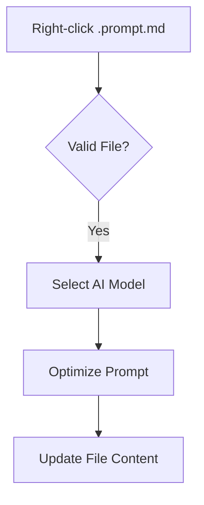
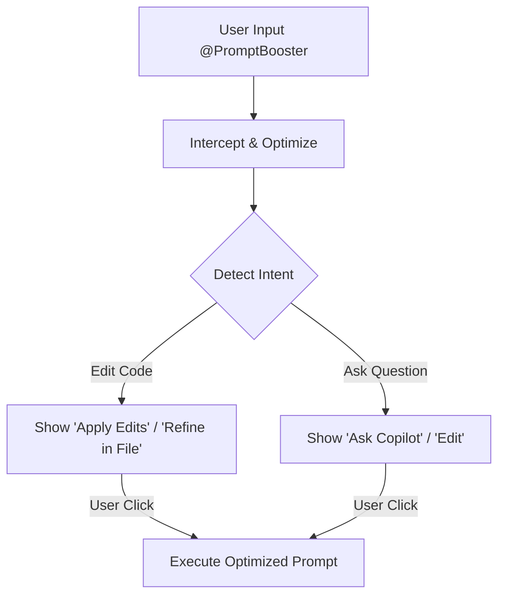
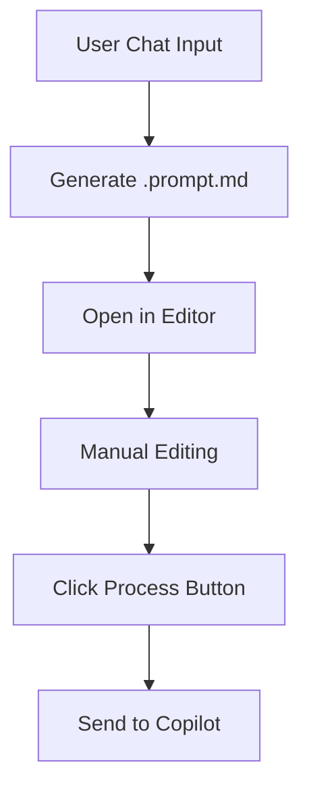

# PromptBooster

A VS Code extension that enhances and optimizes your prompts using AI before sending to GitHub Copilot.

## 🎯 Features

PromptBooster automatically detects your context to provide the best optimization experience:
- **Chat**: Type `@PromptBooster` to instantly optimize your chat prompt.
- **Editor**: Right-click any `.prompt.md` file to boost it.

### ✅ Real-time Optimization (Chat)

- **Context-Aware**: Reads the content of files you reference (e.g., `#file:utils.ts`) to give the AI crucial context.
- **Smart Intent Detection**: Automatically detects if you are *Asking* or *Editing*.
- **Dynamic Actions**:
  - `$(sparkle) Apply to Chat`: Copies the optimized prompt to Copilot input.
  - `$(new-file) Refine in File`: Creates a `.prompt.md` file for manual editing.

### ✅ Manual Refinement (Editor)

- **Persistent**: Work in `.prompt.md` files for complex prompt engineering.
- **Version Control**: Save your best prompts to `.github/prompts/`.
- **Right-click Boost**: Enhance your drafts with one click.
- **Process Prompt File**: Execute your perfected prompt directly to Copilot via the Status Bar or Command Palette.

## 🚀 Quick Start

### Installation

1. Install "PromptBooster" from VS Code Extensions
2. Ensure GitHub Copilot extension is installed and active

### 1. In Chat (Real-time)

1. Open Copilot Chat.
2. Type `@PromptBooster #file:current.ts Refactor this code`.
3. **Intent Detection**: The extension sees you want to *Edit*.
4. Click `$(sparkle) Apply to Chat` to use the optimized prompt.

### 2. In Editor (Manual File)

1. Create a file named `my-task.prompt.md`.
2. Write your rough idea:
   ```markdown
   Write a react component for a login form
   ```
3. Right-click → **PromptBooster: Boost This Prompt**.
4. The file updates with a professional, structured prompt.
5. Click the `Run` CodeLens or "Process Prompt" in the status bar to send it to Copilot.

## 📦 Building & Packaging

To build the extension for distribution:

```bash
npm run package
```

This generates a `.vsix` file in the `dist/` folder, which is automatically excluded from git. You can then:

- **Test locally**: Install the VSIX manually in VS Code
- **Publish**: Use `vsce publish` to publish to the VS Code Marketplace
- **Share**: Distribute the VSIX file to others for manual installation

## ⚙️ Configuration

Configure in VS Code Settings (`Cmd+,`):

| Setting               | Default         | Options                           | Description                          |
| --------------------- | --------------- | --------------------------------- | ------------------------------------ |
| `operationMode`       | manual          | manual, realtime, file            | Current operation mode               |
| `autoOptimize`        | false           | true, false                       | Auto-optimize in realtime/file modes |
| `showPreview`         | true            | true, false                       | Show preview before submitting       |
| `fileOutputDirectory` | .github/prompts | any valid path                    | Where to save generated files        |
| `fileNamingPattern`   | prompt          | timestamp, prompt, custom         | File naming strategy                 |
| `modelPreference`     | gpt-4.1         | gpt-4.1, gpt-4o, claude-haiku-4.5 | Preferred AI model                   |

## 📋 Commands

Access via Command Palette (`Cmd+Shift+P`) or use npm scripts:

| Script                | Purpose                         |
| --------------------- | ------------------------------- |
| `npm run compile`     | Compile TypeScript to JavaScript |
| `npm run watch`       | Watch mode for development      |
| `npm run lint`        | Run ESLint checks               |
| `npm run test`        | Run test suite                  |
| `npm run package`     | Build VSIX in `dist/` folder    |

### VS Code Commands

Access via Command Palette (`Cmd+Shift+P`):

- **PromptBooster: Boost This Prompt** - Enhance `.prompt.md` file (Manual Mode)
- **PromptBooster: Switch Operation Mode** - Change between modes
- **PromptBooster: Toggle Auto-Optimization** - Turn auto-optimization on/off
- **PromptBooster: Switch AI Model** - Choose which AI model to use
- **PromptBooster: Configure Permissions** - Manage interception permissions
- **PromptBooster: Process Prompt File** - Process generated `.prompt.md` file (File Mode)
- **PromptBooster: Test File Generation** - Test file generation feature
- **PromptBooster: Test Realtime Mode** - Test realtime mode integration

## 🛠️ Requirements

### Runtime

- **VS Code**: 1.99.0 or higher
- **GitHub Copilot**: Active subscription (for Language Model API access)
- **OS**: macOS, Windows, or Linux

### Development & Building

- **Node.js**: 20.x or higher
- **npm**: 8.x or higher
- **VSCE**: Automatically installed with dev dependencies (for `npm run package`)

## 🎯 What's Implemented

### 🔧 Manual Mode

- Right-click enhancement of `.prompt.md` files
- AI-powered prompt optimization and structuring
- Flexible AI model selection (gpt-4.1, gpt-4o, claude-haiku-4.5)
- Selection-based partial optimization
- Real-time progress notifications with cancel option

### ⚡ Real-time Mode

- Chat participant integration (`@PromptBooster` in Copilot chat)
- Automatic prompt interception and enhancement
- **Smart Intent Detection** - Distinguishes between "ask" and "edit" intents
- Dynamic context-aware button suggestions
- Structured prompt format with Task/Context/Requirements/Output sections
- Chat reference support (`#selection`, `#file`, `#editor`)
- Direct AI response streaming
- Auto-optimization with configurable timeout

### 📝 File Mode

- Automatic `.prompt.md` file generation from chat input
- Three file naming strategies: timestamp, prompt-based, custom
- Dedicated file storage in `.github/prompts/` directory
- Collision detection and automatic resolution
- Process button for direct execution
- CodeLens indicators for quick workflow
- HTML comment metadata preservation
- Full editor integration with syntax highlighting

### 🛠️ Core Infrastructure

- Comprehensive configuration system with VS Code settings integration
- Mode management and switching via status bar
- Language model provider abstraction with fallback logic
- Dependency injection container for service orchestration
- Robust error handling and logging
- Full extension API compliance

## 🚀 How It Works

### Manual Mode


```mermaid
flowchart TD
    A[Right-click .prompt.md] --> B{Valid File?}
    B -->|Yes| C[Select AI Model]
    C --> D[Optimize Prompt]
    D --> E[Update File Content]
```

### Real-time Mode (Smart Intent)


```mermaid
flowchart TD
    Start[User Input @PromptBooster] --> Intercept[Intercept & Optimize]
    Intercept --> Check{Detect Intent}
    
    Check -->|Edit Code| EditUI[Show 'Apply Edits' / 'Refine in File']
    Check -->|Ask Question| AskUI[Show 'Ask Copilot' / 'Edit']
    
    EditUI -->|User Click| Run[Execute Optimized Prompt]
    AskUI -->|User Click| Run
```

### File Mode


```mermaid
flowchart TD
    Start[User Chat Input] --> Gen[Generate .prompt.md]
    Gen --> Open[Open in Editor]
    Open --> Edit[Manual Editing]
    Edit --> Process[Click Process Button]
    Process --> Send[Send to Copilot]
```

## 🎨 Status Bar & UI

- **Status bar item** (bottom right): Shows current mode
  - 🔧 Manual Mode - File-based enhancement
  - ⚡ Real-time Mode - Chat interception with preview
  - 📝 File Mode - Generate editable files
- **Click to switch modes** - Opens Quick Pick menu
- **Process button** - Appears in file mode for `.prompt.md` files
- **CodeLens** - "▶️ Process this prompt" at top of `.prompt.md` files
- **Progress notifications** - With cancel button during optimization
- **Output channel** - Detailed logging in "PromptBooster" channel

## 💡 Tips

### For Best Results

1. **Use with complex prompts**: Let PromptBooster add structure and detail
2. **Review in real-time mode**: Learn how prompts are enhanced
3. **Use references**: `#selection`, `#file` provide better context
4. **Check the logs**: `View → Output → PromptBooster` shows what's happening
5. **Try different models**: Use "Switch AI Model" to experiment
6. **Edit before processing**: File mode gives full control

### When to Use Each Mode

| Mode      | When                        | Example                                      |
| --------- | --------------------------- | -------------------------------------------- |
| Manual    | Want full control           | Open prompt file, manually trigger boost     |
| Real-time | Want automatic help         | Type in chat with references, review preview |
| File      | Want to edit before sending | Generate file, refine prompt, then process   |

### File Mode Naming Strategies

| Strategy  | Example Output                         | Best For                  |
| --------- | -------------------------------------- | ------------------------- |
| timestamp | `chat-2026-02-05T14-30-00.prompt.md`   | No collisions, unique IDs |
| prompt    | `create-rest-api.prompt.md`            | Descriptive, readable     |
| custom    | User enters: `my-api-design.prompt.md` | Complete control          |

## 🔗 Links

- [GitHub Repository](https://github.com/sonquach/prompt-buster)
- [GitHub Copilot Extension](https://marketplace.visualstudio.com/items?itemName=GitHub.copilot)
- [VS Code Extension API](https://code.visualstudio.com/api)
- [Language Model API Docs](https://code.visualstudio.com/api/extension-guides/language-model)

## 📄 License

MIT License - Created by Son Quach

## 🐛 Troubleshooting

### "No language model available"

- Ensure GitHub Copilot is installed and active
- Sign in to Copilot with your GitHub account
- Check your Copilot subscription status
- Restart VS Code

### Context menu doesn't appear

- File must end with `.prompt.md` (case-sensitive)
- Save the file before right-clicking
- Reload window: `Developer: Reload Window`

### Real-time mode not working

- Enable auto-optimize: `Cmd+Shift+P` → "Toggle Auto-Optimization"
- Check current mode in status bar (should show ⚡ Real-time)
- Use `@PromptBooster` prefix in chat
- Check Output channel for errors

### File mode not creating files

- Ensure workspace folder is open
- Check `fileOutputDirectory` setting (default: `.github/prompts`)
- Verify write permissions in workspace
- Check Output channel for detailed errors

### Optimization timeout

- Default timeout is 10 seconds
- Complex prompts may need more time
- Extension falls back to original prompt with context
- Check Output channel for "Optimization timed out" message

### Chat references not included

- Use `#selection`, `#file`, or `#editor` in your prompt
- References are automatically extracted and added to context
- Check Output channel for "Including X reference(s)" message
- Verify files are saved before using `#file` reference

## 🙋 Support

- Open an issue on [GitHub](https://github.com/sonquach/prompt-buster/issues)
- Review [CHANGELOG.md](CHANGELOG.md) for recent changes

---

**PromptBooster**: Enhance your prompts. Better prompts → Better results! ✨
