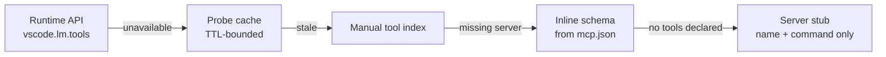
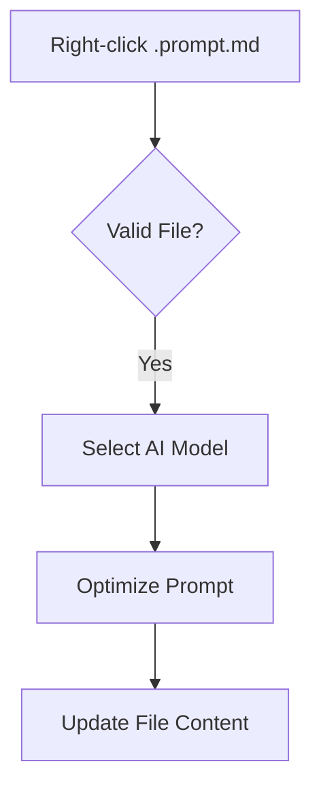
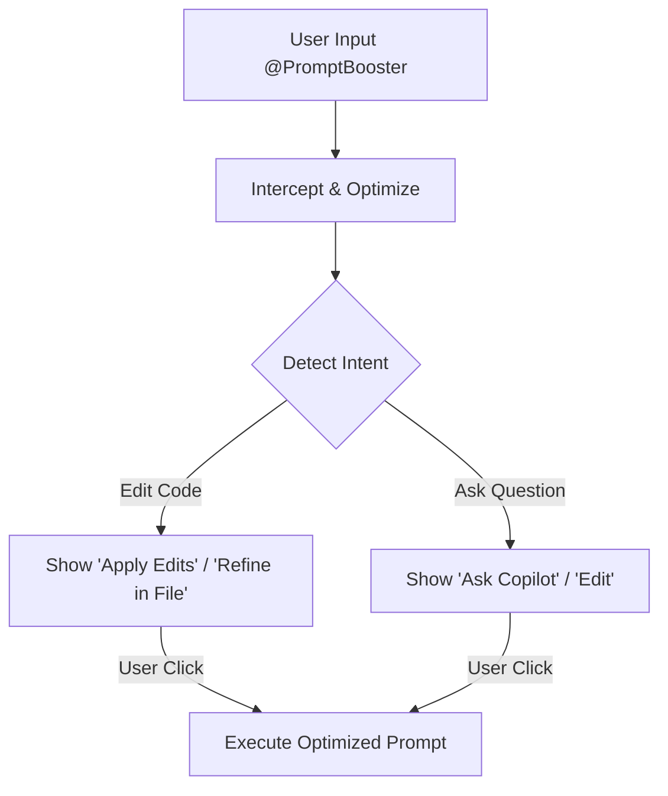
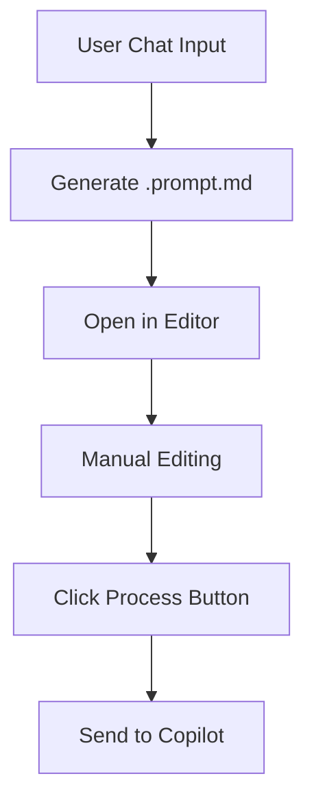

# PromptBooster

A VS Code extension that enhances and optimizes your prompts using AI before sending to GitHub Copilot — and makes those prompts **tool-aware**: it discovers which MCP tools your environment actually offers and weaves the right tool references directly into the prompt, so the agent reaches for the right tool on the first turn instead of probing.

## 🎯 Features

PromptBooster automatically detects your context to provide the best optimization experience:
- **Chat**: Type `@PromptBooster` to instantly optimize your chat prompt.
- **Editor**: Right-click any `.prompt.md` file to boost it.
- **Tool-aware** (v2): discovers your MCP tool landscape, scores tools against your prompt, and injects the winners inline — with a response cache and an acceptance-based feedback loop that learns from what you actually use.

### ✅ Real-time Optimization (Chat)

- **Context-Aware**: Reads the content of files you reference (e.g., `#file:utils.ts`) to give the AI crucial context.
- **Smart Intent Detection**: Automatically detects if you are *Asking* or *Editing*.
- **Tool-Aware Rewrites**: MCP tool references are woven inline into the optimized prompt.
- **Dynamic Actions**:
  - `$(sparkle) Apply to Chat`: Copies the optimized prompt to Copilot input.
  - `$(new-file) Refine in File`: Creates a `.prompt.md` file for manual editing.

### ✅ Manual Refinement (Editor)

- **Persistent**: Work in `.prompt.md` files for complex prompt engineering.
- **Version Control**: Save your best prompts to `.github/prompts/`.
- **Right-click Boost**: Enhance your drafts with one click.
- **Process Prompt File**: Execute your perfected prompt directly to Copilot via the Status Bar or Command Palette.

## 🔌 MCP-Aware Tool Provisioning (v2)

PromptBooster discovers the tools your environment offers through a **discovery waterfall** — each stage is a fallback for the previous one, so the optimizer always has the best available catalog without ever blocking your prompt:


```mermaid
flowchart LR
    A[Runtime API<br/>vscode.lm.tools] -->|unavailable| B[Probe cache<br/>TTL-bounded]
    B -->|stale| C[Manual tool index]
    C -->|missing server| D[Inline schema<br/>from mcp.json]
    D -->|no tools declared| E[Server stub<br/>name + command only]
```

- **Scorer v2**: a zero-LLM, zero-latency classifier scores every discovered tool against your prompt (token overlap with length normalization, whole-word name bonuses, hard cap of 5 injected tools). Only precision-qualified winners reach the optimizer.
- **Injection gating**: tool descriptions are third-party, untrusted input — they are sanitized (control characters stripped, 200-char cap, ~1,500-char total budget) before entering the optimizer prompt.
- **Optimizer response cache**: identical prompts within the TTL skip the LLM round-trip entirely (workspace state, LRU-bounded).
- **Feedback loop**: your decisions (accept / edit / reject) are recorded in workspace-local state. Only confirmed positives are ever promoted; the feedback report shows the full funnel.
- **Learning (opt-in)**: with `learning.fewShotFromFeedback` enabled, prompts you explicitly accepted become few-shot examples for future optimizations in that workspace. Off by default — it re-sends prompt text to the model provider.

**Privacy-first defaults**: server probing (background-launching your MCP servers to list their tools) is strictly opt-in; foreign servers (other editors' configs) are off by default; feedback records never write prompt text to a committable file.

## 🚀 Quick Start

### Installation

1. Install "PromptBooster" from VS Code Extensions
2. Ensure GitHub Copilot extension is installed and active

### 1. In Chat (Real-time)

1. Open Copilot Chat.
2. Type `@PromptBooster #file:current.ts Refactor this code`.
3. **Intent Detection**: The extension sees you want to *Edit*.
4. Click `$(sparkle) Apply to Chat` to use the optimized prompt.

### 2. In Editor (Manual File)

1. Create a file named `my-task.prompt.md`.
2. Write your rough idea:
   ```markdown
   Write a react component for a login form
   ```
3. Right-click → **PromptBooster: Boost This Prompt**.
4. The file updates with a professional, structured prompt.
5. Click the `Run` CodeLens or "Process Prompt" in the status bar to send it to Copilot.

## ⚙️ Configuration

Configure in VS Code Settings (`Cmd+,`). All settings live under the `promptBooster.` prefix.

### General

| Setting                   | Default          | Options                           | Description                            |
| ------------------------- | ---------------- | --------------------------------- | -------------------------------------- |
| `operationMode`           | manual           | manual, realtime, file            | Current operation mode                 |
| `simplifiedContextMode`   | true             | true, false                       | Chat always uses Realtime mode, Editor uses Manual mode |
| `autoOptimize`            | false            | true, false                       | Auto-optimize in realtime/file modes   |
| `showPreview`             | true             | true, false                       | Show preview before submitting         |
| `fileOutputDirectory`     | .github/prompts  | any valid path                    | Where to save generated files          |
| `fileNamingPattern`       | prompt           | timestamp, prompt, custom         | File naming strategy                   |
| `modelPreference`         | claude-haiku-4.5 | gpt-4.1, gpt-4o, claude-haiku-4.5 | Preferred AI model                     |

### MCP Tool Discovery

| Setting                        | Default | Description                                                                                  |
| ------------------------------ | ------- | -------------------------------------------------------------------------------------------- |
| `mcp.probeServers`             | false   | **Opt in**: PromptBooster may launch your configured MCP servers in the background (stdio, hard 6s timeout) to discover their real tool lists. Runs only on activation, config change, or via the *Refresh MCP Tool Index* command — never while enhancing a prompt. |
| `mcp.includeForeignServers`    | false   | Include tools discovered from other editors' MCP configs (Claude Desktop, Cursor, Cline). They are annotated as *other-editor tool — only use if available here* because the Copilot agent may not be able to execute them. |
| `mcp.cacheTtlMinutes`          | 10      | How long the discovered MCP tool catalog stays trusted before it is revalidated in the background (stale results are served immediately). |

### Feedback & Learning

| Setting                          | Default | Description                                                                                   |
| -------------------------------- | ------- | --------------------------------------------------------------------------------------------- |
| `feedback.enabled`               | true    | Record prompt-enhancement decisions (accepted / rejected / edited) in workspace-local state to power the feedback report. Never writes prompt text to a committable file. |
| `feedback.historyLimit`          | 200     | How many resolved feedback records are kept (oldest dropped first).                            |
| `learning.fewShotFromFeedback`   | false   | **Opt in**: send prompts you explicitly accepted back to the model provider as few-shot examples when enhancing future prompts in this workspace. This shares prompt text with the model provider again — off by default. |
| `learning.maxFewShotExamples`    | 5       | Maximum number of few-shot examples derived from accepted feedback.                            |
| `learning.fewShotCharBudget`     | 2000    | Total character budget for the few-shot example block appended to the optimizer input.         |

### Optimizer Response Cache

| Setting              | Default | Description                                                                     |
| -------------------- | ------- | ------------------------------------------------------------------------------- |
| `cache.enabled`      | true    | Cache the optimizer's LLM output per prompt (workspace state). Identical prompts within the TTL skip the model round-trip; everything deterministic always re-runs. |
| `cache.ttlDays`      | 7       | How long a cached optimizer response stays valid.                                |
| `cache.maxEntries`   | 200     | Maximum number of cached optimizer responses (least recently used evicted first). |

## 📋 Commands

Access via Command Palette (`Cmd+Shift+P`):

**Workflow**

- **PromptBooster: Boost This Prompt** — Enhance `.prompt.md` file (Manual Mode)
- **PromptBooster: Switch Operation Mode** — Change between modes
- **PromptBooster: Toggle Auto-Optimization** — Turn auto-optimization on/off
- **PromptBooster: Switch AI Model** — Choose which AI model to use
- **PromptBooster: Configure Permissions** — Manage interception permissions
- **PromptBooster: Process Prompt File** — Process generated `.prompt.md` file (File Mode)
- **PromptBooster: Test File Generation** — Test file generation feature
- **PromptBooster: Test Realtime Mode** — Test realtime mode integration

**MCP & Feedback (v2)**

- **PromptBooster: Refresh MCP Tool Index** — Re-run MCP discovery now (the only manual probe trigger)
- **PromptBooster: Use This Prompt Version** — Adopt a version from the diff view as your final prompt
- **PromptBooster: Show Feedback Report** — Funnel, acceptance, retention, and cache hit-rate report
- **PromptBooster: Export MCP Golden-Set Candidates** — Export retained references as a JSON golden-set file for offline evaluation

## 🛠️ Development

```bash
npm run compile   # TypeScript → out/
npm run watch     # Watch mode
npm run lint      # ESLint (src, TypeScript)
npm test          # 155 unit tests via @vscode/test-electron
npm run package   # Build VSIX into dist/
```

Architecture and conventions live in [AGENTS.md](AGENTS.md):

- **Layered DI architecture** — `core` (host-free mechanism) / `infrastructure` (host adapters) / `presentation` (commands & UI) / `shared` (interfaces & types), wired by symbol-keyed DI in `src/di/`.
- **Layering rule** — `src/core/**` never imports `vscode`; host capabilities reach core through ports in `src/shared/interfaces/`.
- Diagrams: [docs/architecture_diagrams.md](docs/architecture_diagrams.md) · v2 design: [docs/plans/mcp-aware-tool-provisioning-v2.md](docs/plans/mcp-aware-tool-provisioning-v2.md)

## 🗺️ Roadmap

**Claude Code plugin port** — design approved 2026-09-09, implementation next. The same mechanism as a Claude Code plugin: a `/boost` skill for the rewrite UX, `PostToolUse` hook telemetry as *direct* per-tool ground truth (stronger labels than any acceptance button), file-backed cache/learning stores, and the shared `src/core` reused behind Node adapters. See [docs/plans/claude-code-plugin-design.md](docs/plans/claude-code-plugin-design.md).

## 🎯 What's Implemented

### 🔌 MCP-Aware Tool Provisioning (v2)

- Discovery waterfall: runtime API → probe cache → manual index → inline schema → server stub
- Scorer v2 — precision-focused, deterministic tie-breaking, hard cap of 5 injected tools
- Sanitized, budget-capped injection of untrusted tool descriptions
- Optimizer response cache (LRU + TTL, workspace state)
- Acceptance-based feedback capture and report; golden-set candidate export
- Opt-in few-shot learning from confirmed positives

### 🔧 Manual Mode

- Right-click enhancement of `.prompt.md` files
- AI-powered prompt optimization and structuring
- Flexible AI model selection (gpt-4.1, gpt-4o, claude-haiku-4.5)
- Selection-based partial optimization
- Real-time progress notifications with cancel option

### ⚡ Real-time Mode

- Chat participant integration (`@PromptBooster` in Copilot chat)
- Automatic prompt interception and enhancement
- **Smart Intent Detection** — distinguishes between "ask" and "edit" intents
- Dynamic context-aware button suggestions
- Structured prompt format with Task/Context/Requirements/Output sections
- Chat reference support (`#selection`, `#file`, `#editor`)
- Direct AI response streaming
- Auto-optimization with configurable timeout

### 📝 File Mode

- Automatic `.prompt.md` file generation from chat input
- Three file naming strategies: timestamp, prompt-based, custom
- Dedicated file storage in `.github/prompts/` directory
- Collision detection and automatic resolution
- Process button for direct execution
- CodeLens indicators for quick workflow
- HTML comment metadata preservation
- Full editor integration with syntax highlighting

### 🛠️ Core Infrastructure

- Comprehensive configuration system with VS Code settings integration
- Mode management and switching via status bar
- Language model provider abstraction with fallback logic
- Dependency injection container for service orchestration
- Robust error handling and logging
- Full extension API compliance
- 155 unit tests across core services

## 🚀 How It Works

### Manual Mode


```mermaid
flowchart TD
    A[Right-click .prompt.md] --> B{Valid File?}
    B -->|Yes| C[Select AI Model]
    C --> D[Optimize Prompt]
    D --> E[Update File Content]
```

### Real-time Mode (Smart Intent)


```mermaid
flowchart TD
    Start[User Input @PromptBooster] --> Intercept[Intercept & Optimize]
    Intercept --> Check{Detect Intent}
    
    Check -->|Edit Code| EditUI[Show 'Apply Edits' / 'Refine in File']
    Check -->|Ask Question| AskUI[Show 'Ask Copilot' / 'Edit']
    
    EditUI -->|User Click| Run[Execute Optimized Prompt]
    AskUI -->|User Click| Run
```

### File Mode


```mermaid
flowchart TD
    Start[User Chat Input] --> Gen[Generate .prompt.md]
    Gen --> Open[Open in Editor]
    Open --> Edit[Manual Editing]
    Edit --> Process[Click Process Button]
    Process --> Send[Send to Copilot]
```

## 🎨 Status Bar & UI

- **Status bar item** (bottom right): Shows current mode
  - 🔧 Manual Mode - File-based enhancement
  - ⚡ Real-time Mode - Chat interception with preview
  - 📝 File Mode - Generate editable files
- **Click to switch modes** - Opens Quick Pick menu
- **Process button** - Appears in file mode for `.prompt.md` files
- **CodeLens** - "▶️ Process this prompt" at top of `.prompt.md` files
- **Progress notifications** - With cancel button during optimization
- **Output channel** - Detailed logging in "PromptBooster" channel

## 💡 Tips

### For Best Results

1. **Use with complex prompts**: Let PromptBooster add structure and detail
2. **Review in real-time mode**: Learn how prompts are enhanced
3. **Use references**: `#selection`, `#file` provide better context
4. **Check the logs**: `View → Output → PromptBooster` shows what's happening
5. **Try different models**: Use "Switch AI Model" to experiment
6. **Edit before processing**: File mode gives full control
7. **Watch the feedback report**: "Show Feedback Report" shows which enhancements you actually keep

### When to Use Each Mode

| Mode      | When                        | Example                                      |
| --------- | --------------------------- | -------------------------------------------- |
| Manual    | Want full control           | Open prompt file, manually trigger boost     |
| Real-time | Want automatic help         | Type in chat with references, review preview |
| File      | Want to edit before sending | Generate file, refine prompt, then process   |

### File Mode Naming Strategies

| Strategy  | Example Output                         | Best For                  |
| --------- | -------------------------------------- | ------------------------- |
| timestamp | `chat-2026-02-05T14-30-00.prompt.md`   | No collisions, unique IDs |
| prompt    | `create-rest-api.prompt.md`            | Descriptive, readable     |
| custom    | User enters: `my-api-design.prompt.md` | Complete control          |

## 🔗 Links

- [GitHub Repository](https://github.com/sonqh/prompt-booster)
- [GitHub Copilot Extension](https://marketplace.visualstudio.com/items?itemName=GitHub.copilot)
- [VS Code Extension API](https://code.visualstudio.com/api)
- [Language Model API Docs](https://code.visualstudio.com/api/extension-guides/language-model)

## 📄 License

MIT License - Created by Son Quach

## 🐛 Troubleshooting

### "No language model available"

- Ensure GitHub Copilot is installed and active
- Sign in to Copilot with your GitHub account
- Check your Copilot subscription status
- Restart VS Code

### Context menu doesn't appear

- File must end with `.prompt.md` (case-sensitive)
- Save the file before right-clicking
- Reload window: `Developer: Reload Window`

### Real-time mode not working

- Enable auto-optimize: `Cmd+Shift+P` → "Toggle Auto-Optimization"
- Check current mode in status bar (should show ⚡ Real-time)
- Use `@PromptBooster` prefix in chat
- Check Output channel for errors

### File mode not creating files

- Ensure workspace folder is open
- Check `fileOutputDirectory` setting (default: `.github/prompts`)
- Verify write permissions in workspace
- Check Output channel for detailed errors

### MCP tools not appearing in optimized prompts

- Run **PromptBooster: Refresh MCP Tool Index**, then check the Output channel for discovery results
- Probing is opt-in — enable `mcp.probeServers` if you want real tool lists from servers that declare no inline schema
- Tools from other editors' configs require `mcp.includeForeignServers`
- The scorer only injects precision-qualified tools; a tool that loosely matches your prompt is deliberately left out

### Optimization timeout

- Default timeout is 10 seconds
- Complex prompts may need more time
- Extension falls back to original prompt with context
- Check Output channel for "Optimization timed out" message

### Chat references not included

- Use `#selection`, `#file`, or `#editor` in your prompt
- References are automatically extracted and added to context
- Check Output channel for "Including X reference(s)" message
- Verify files are saved before using `#file` reference

## 🙋 Support

- Open an issue on [GitHub](https://github.com/sonqh/prompt-booster/issues)
- Review [CHANGELOG.md](CHANGELOG.md) for recent changes

---

**PromptBooster**: Enhance your prompts. Better prompts → Better results! ✨
