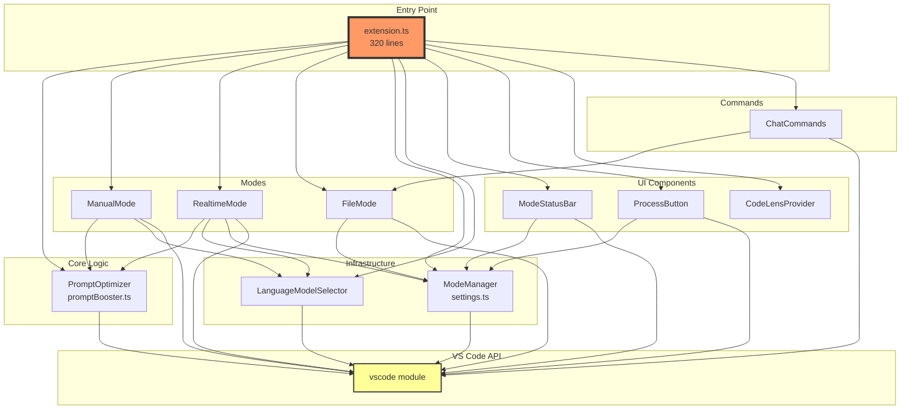
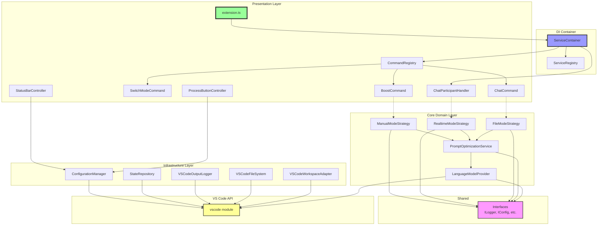
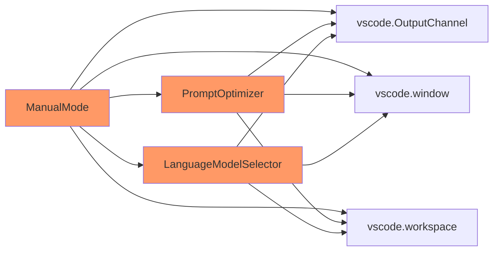
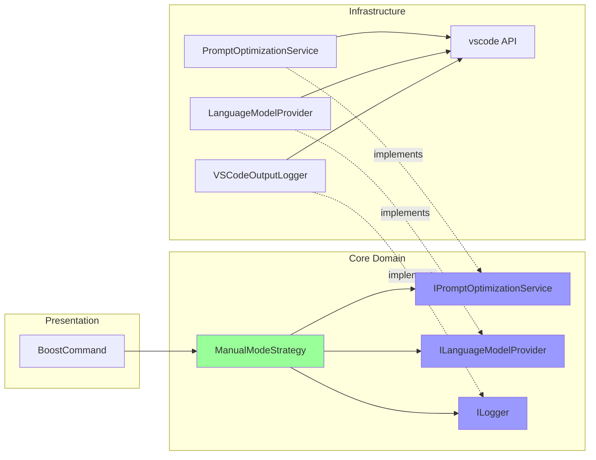
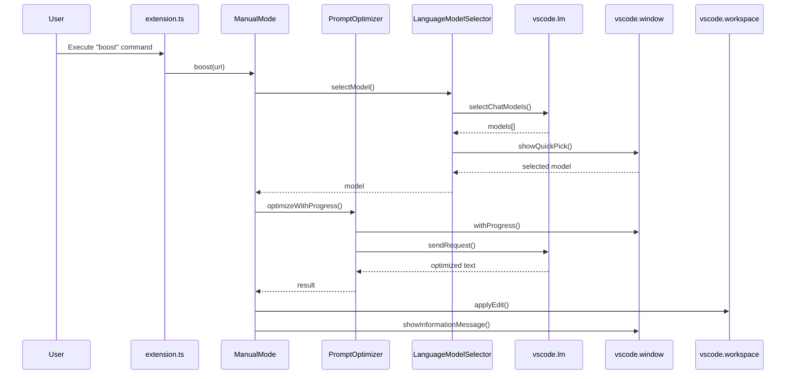
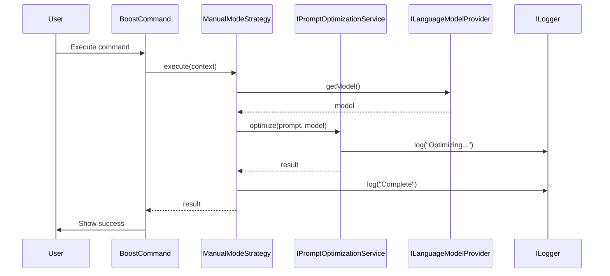
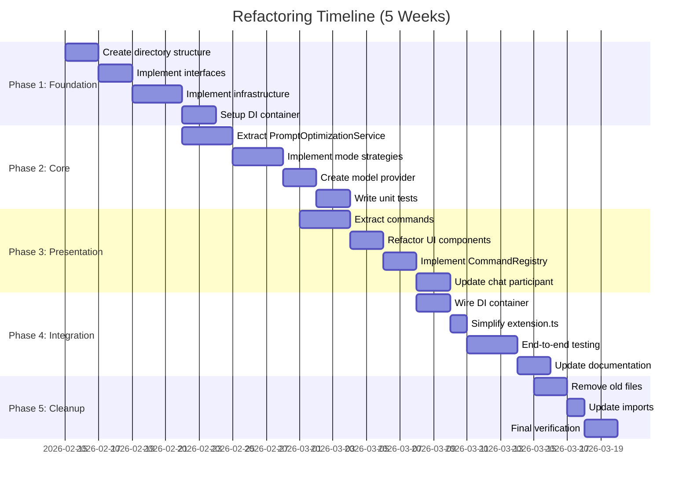

# PromptBooster Architecture Diagrams

## Current Architecture Overview



### Issues with Current Architecture

- **God Object**: `extension.ts` knows about everything
- **Tight Coupling**: Every component directly depends on VS Code API
- **No Abstraction**: No interfaces or dependency injection
- **Testing Difficulty**: Hard to test in isolation

---

## Architecture Overview



### Benefits of Proposed Architecture

- **Layered Design**: Clear separation between presentation, domain, and infrastructure
- **Dependency Inversion**: Core depends on interfaces, not concrete implementations
- **Testability**: Core logic can be tested without VS Code
- **Extensibility**: Easy to add new modes, commands, or providers

---

## Component Dependency Flow

### Current: Tightly Coupled



**Problems:**

- Direct VS Code API dependencies everywhere
- Impossible to test without VS Code environment
- No abstraction boundaries

### Proposed: Dependency Inversion



**Benefits:**

- Core depends only on interfaces
- Infrastructure adapts VS Code to interfaces
- Easy to mock for testing
- Can swap implementations

---

## Data Flow: Manual Mode Boost

### Current Flow



### Proposed Flow



**Benefits:**

- Cleaner flow with fewer dependencies
- All VS Code interactions abstracted
- Each component has single responsibility
- Easy to trace and debug

---

## Extension Activation Comparison

### Current Activation (320 lines)

```typescript
export function activate(context: vscode.ExtensionContext) {
  // Create outputChannel
  // Create modeManager
  // Create modelSelector
  // Create optimizer
  // Create statusBar
  // Create processButton
  // Create manualMode
  // Create fileMode
  // Create chatCommands
  // Register 8+ commands manually
  // Register CodeLens provider
  // Register chat participant
  // Handle errors
  // Show welcome message
  // Add test commands
}
```

### Proposed Activation (~30 lines)

```typescript
export function activate(context: vscode.ExtensionContext) {
  const container = createContainer(context);
  const commandRegistry = container.resolve<CommandRegistry>("commandRegistry");
  const chatParticipant =
    container.resolve<ChatParticipantHandler>("chatParticipant");

  commandRegistry.registerAll(context);
  chatParticipant.register(context);

  showWelcomeMessage(context);
}

function createContainer(context: vscode.ExtensionContext): Container {
  const container = new Container();
  ServiceRegistry.registerServices(container, context);
  return container;
}
```

---

## Testing Strategy Comparison

### Current: Difficult to Test

```typescript
// Hard to test - requires VS Code environment
class ManualMode {
  constructor(
    private optimizer: PromptOptimizer,
    private modelSelector: LanguageModelSelector,
    private outputChannel: vscode.OutputChannel,
  ) {}

  async boost(uri?: vscode.Uri) {
    const editor = vscode.window.activeTextEditor; // Can't mock
    const model = await this.modelSelector.selectModel(); // UI interaction
    // ... etc
  }
}
```

### Proposed: Easy to Test

```typescript
// Easy to test - all dependencies are interfaces
class ManualModeStrategy implements IModeStrategy {
  constructor(
    private optimizationService: IPromptOptimizationService,
    private modelProvider: ILanguageModelProvider,
    private logger: ILogger,
  ) {}

  async execute(context: ModeExecutionContext): Promise<void> {
    const model = await this.modelProvider.getModel();
    const result = await this.optimizationService.optimize(context.prompt, {
      model,
    });
    this.logger.log("Optimization complete");
    return result;
  }
}

// Unit test
describe("ManualModeStrategy", () => {
  it("should optimize prompt", async () => {
    const mockOptimizer = createMock<IPromptOptimizationService>();
    const mockModelProvider = createMock<ILanguageModelProvider>();
    const mockLogger = createMock<ILogger>();

    const strategy = new ManualModeStrategy(
      mockOptimizer,
      mockModelProvider,
      mockLogger,
    );

    await strategy.execute({ prompt: "test" });

    expect(mockOptimizer.optimize).toHaveBeenCalled();
  });
});
```

---

## Migration Path Visualization



---

## File Count Comparison

### Current Structure

```
src/
├── commands/          (1 file)
├── config/            (1 file)
├── models/            (1 file)
├── modes/             (3 files)
├── ui/                (2 files)
├── extension.ts       (1 file)
└── promptBooster.ts   (1 file)

Total: 10 files, ~2,100 lines
```

### Proposed Structure

```
src/
├── core/
│   ├── services/      (2 files)
│   ├── models/        (2 files)
│   └── strategies/    (4 files)
├── infrastructure/
│   ├── vscode/        (3 files)
│   ├── config/        (2 files)
│   └── state/         (2 files)
├── presentation/
│   ├── commands/      (5 files)
│   ├── ui/            (3 files)
│   └── participants/  (1 file)
├── shared/
│   ├── interfaces/    (3 files)
│   ├── types/         (2 files)
│   └── utils/         (2 files)
├── di/                (3 files)
├── extension.ts       (1 file)
└── deactivate.ts      (1 file)

Total: 36 files, ~2,500 lines
```

**Trade-offs:**

- ✅ More files, but each is smaller and focused
- ✅ Better organization and discoverability
- ✅ Easier to navigate and maintain
- ⚠️ Initial learning curve for new structure

---

## Complexity Metrics

| Metric                                   | Current  | Proposed    | Change  |
| ---------------------------------------- | -------- | ----------- | ------- |
| **Cyclomatic Complexity (extension.ts)** | 45       | 5           | ⬇️ 89%  |
| **Lines per file (average)**             | 210      | 70          | ⬇️ 67%  |
| **Dependency depth**                     | 4 levels | 3 levels    | ⬇️ 25%  |
| **Test coverage**                        | ~0%      | ~80% target | ⬆️ 80%  |
| **Files in src/**                        | 10       | 36          | ⬆️ 260% |
| **Abstraction layers**                   | 0        | 3           | ⬆️ 3    |

---

## Summary

The proposed architecture transforms PromptBooster from a tightly-coupled, monolithic structure into a well-layered, testable, and extensible system. While the file count increases, each file becomes simpler, more focused, and easier to understand. The addition of proper abstractions and dependency injection enables comprehensive testing and future extensibility without breaking existing functionality.
