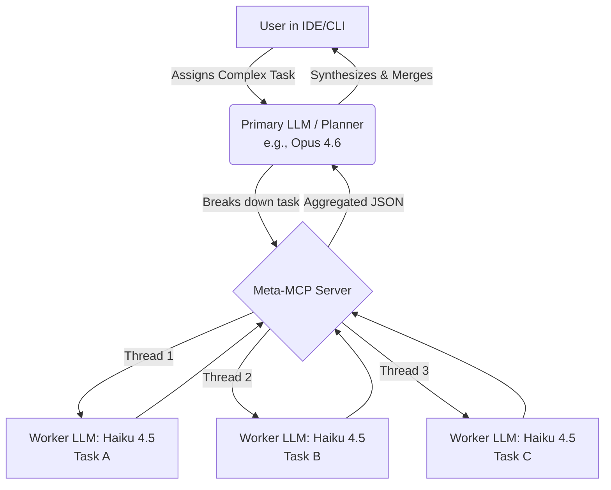
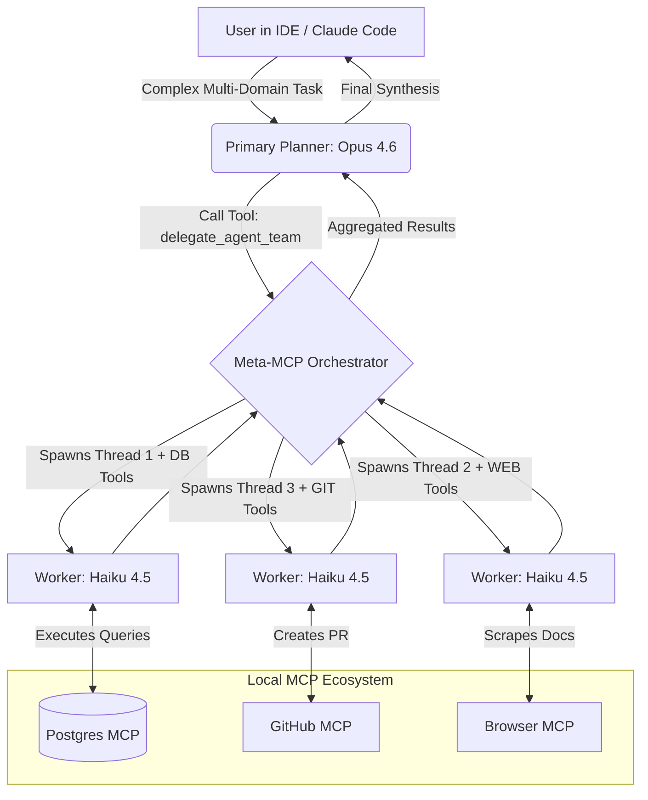
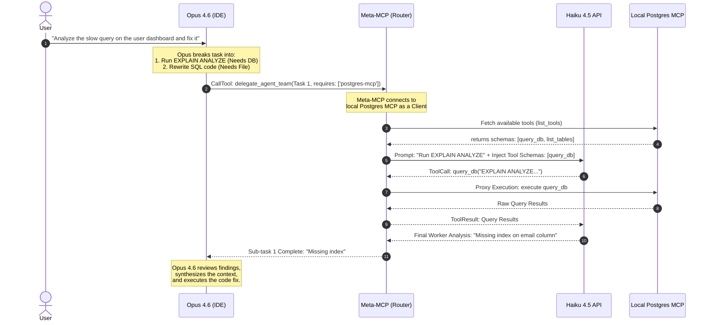

# Universal Meta-MCP Orchestrator

## Asymmetric Agentic Routing & Tool Provisioning

> **Scope:** This document defines the Meta-MCP Orchestrator — a local Node.js MCP server that acts as a dynamic router and tool provisioner for multi-agent parallel execution.
> This is the **execution layer** that complements [PromptBooster's planning layer](promptbooster-intelligent-enhancement.md).

---

## Relationship to PromptBooster

The Meta-MCP Orchestrator and PromptBooster are **complementary systems** with a clean separation of concerns:

| | PromptBooster | Meta-MCP Orchestrator (this doc) |
|---|---|---|
| **Role** | Prompt **planner** — discovers available tools, produces optimally structured prompts | Task **executor** — spawns parallel workers with provisioned MCP tools |
| **Runs where** | Inside the VS Code extension | Separate local Node.js MCP server |
| **Touches MCP tools** | Read-only discovery (config files / VS Code API) | Full execution (proxy calls to local MCPs) |
| **When used alone** | Agent picks better tools from the enhanced prompt | Parallel execution with cost arbitrage |
| **When combined** | PromptBooster produces perfectly structured delegation prompts → Meta-MCP executes the plan with parallel Haiku workers |

**Combined flow:**

```
User prompt → PromptBooster (plan + tool selection) → Enhanced prompt with MCP tool refs
  → Copilot Agent / Opus (reads enhanced prompt, decides to delegate)
  → Meta-MCP Orchestrator (parallel execution via Haiku workers)
  → Aggregated results → Agent synthesizes final answer
```

---

## 1. Context and The Core Problem

### Background

In modern AI-assisted software development, developers use tools like GitHub Copilot or Claude Code. With the release of the **Claude 4.6 model family**, the cognitive capabilities of models like **Opus 4.6** are unprecedented. However, relying on a single, highly capable model for every task creates significant bottlenecks:

1. **Latency (Sequential Processing):** Single-agent LLMs process sequentially, taking a long time to generate massive amounts of code or execute multiple tools one by one.
2. **Context Degradation (Pollution):** As the context window fills up with raw database schemas, scraped HTML, or repetitive boilerplate code, the primary LLM can "forget" core architectural instructions.
3. **Cost & Resource Inefficiency:** Forcing Opus 4.6 to write boilerplate code or execute mundane database queries is economically inefficient.
4. **Tool Bloat:** Developers now run multiple distinct MCP servers locally (e.g., Postgres MCP, GitHub MCP, Puppeteer MCP, FileSystem MCP). Loading all these tools directly into the primary IDE client overwhelms the UI and context.

### The Solution: The "Meta-MCP" Architecture

The solution is an **Asymmetric Multi-Agent Orchestration System** powered by the Model Context Protocol (MCP). Instead of the primary IDE model doing all the work, we introduce a local custom **Meta-MCP Server** that acts as a **Dynamic Router and Tool Provisioner**.

1. **The Planner (Opus 4.6):** The model in your IDE acts as the Chief Architect. It breaks down complex, multi-domain tasks.
2. **The Meta-MCP Orchestrator:** A local Node.js server that acts as a proxy/gateway.
3. **The Workers (Haiku 4.5):** The Orchestrator spawns lightweight, lightning-fast models in parallel to execute the sub-tasks. Crucially, the Meta-MCP *dynamically equips these Workers* with specific local MCP tools they need (e.g., giving Worker 1 database access, and Worker 2 GitHub access).

---

## 2. Conceptual Architecture Diagrams

### 2.1 The Map-Reduce Execution Flow

This diagram shows how a single monolithic task is broken down into parallel coding tasks.



### 2.2 The Universal Meta-MCP Tool Routing

This diagram illustrates how the Meta-MCP provisions existing local MCP tools to the ephemeral Haiku agents.



---

## 3. Applicability & Key Capabilities

- **Bulk Refactoring & Translation:** Updating syntax across dozens of files simultaneously, or translating a large codebase (e.g., Python to TypeScript) file by file in parallel.
- **Automated QA & Bug Fixing:** Worker 1 uses Browser MCP to reproduce a bug, Worker 2 uses FileSystem MCP to fix the code, Worker 3 uses GitHub MCP to push the PR.
- **Data Engineering Pipelines:** Worker 1 uses Postgres MCP to extract data, Worker 2 processes the data logic, Worker 3 uses Google Drive MCP to upload the final report.
- **Context Gathering (RAG on steroids):** Searching local Jira, Confluence, and GitHub issues simultaneously using Haiku agents to compile an architectural brief before Opus 4.6 writes a single line of code.

### Key Effectiveness Points

- **Divide and Conquer:** Overcomes the cognitive and output token limits of single models.
- **Cost Arbitrage:** Shifts 80% of the token generation to Haiku 4.5, which is significantly cheaper than Opus 4.6.
- **Isolated Contexts:** Each worker only sees the code/tools relevant to its specific sub-task, practically eliminating cross-module hallucinations.

---

## 4. Technical Architecture & Components

### System Components

- **Client (Host):** GitHub Copilot (via VS Code MCP integration) or Claude Code CLI.
- **Planner Agent:** Claude 4.6 Opus (Highest cognitive capability).
- **Meta-MCP Server (Node.js):** Custom router that implements *both* MCP Server protocols (to expose tools to Copilot/Opus) and MCP Client protocols (to connect to your other local MCPs like Postgres/GitHub).
- **Worker Agents:** Claude 4.6 Haiku API (Extreme speed, low cost).

### Tool Schema Design

The Meta-MCP exposes the `delegate_agent_team` tool to the Planner (Opus). Notice the `required_mcp_servers` array, which tells the Meta-MCP which local tools to proxy to the workers.

```json
{
  "name": "delegate_agent_team",
  "description": "Spawns parallel Haiku 4.5 agents equipped with specific local MCP tools to solve complex, multi-domain tasks.",
  "inputSchema": {
    "type": "object",
    "properties": {
      "team_name": { "type": "string" },
      "subTasks": {
        "type": "array",
        "items": {
          "type": "object",
          "properties": {
            "taskId": { "type": "string" },
            "instructions": { "type": "string", "description": "Detailed prompt for the Haiku worker" },
            "contextFiles": { "type": "array", "items": { "type": "string" }, "description": "Specific files this worker needs to read/edit" },
            "required_mcp_servers": {
              "type": "array",
              "items": { "type": "string" },
              "description": "Names of local MCP servers this worker needs (e.g., ['postgres-mcp', 'github-mcp'])"
            }
          }
        }
      }
    },
    "required": ["team_name", "subTasks"]
  }
}
```

---

## 5. How It Works (End-to-End Sequence)

This sequence diagram illustrates the exact lifecycle from a complex user prompt, involving tool proxying to local MCPs.



---

## 6. Metrics: Before and After (Universal Workflow)

*Example Task: "Read Jira ticket, query Postgres for schema, fix the TypeScript code in 5 files, push PR."*

| **Metric**              | **Single Agent (Opus 4.6 Only)**                             | **Meta-MCP (Opus 4.6 + Haiku 4.5 + Local MCPs)**                              | **Improvement**                 |
| :---------------------: | :----------------------------------------------------------: | :---------------------------------------------------------------------------: | :-----------------------------: |
| **Execution Paradigm**  | Sequential Tool Calling & Coding                             | Parallel Tool Calling & Coding                                                | **Massive throughput increase** |
| **Time to Completion**  | 4-5 minutes (Waiting for serial tool calls & large code gen) | ~45 seconds                                                                   | **~5x Faster 🚀**               |
| **Context Window Used** | 100k+ tokens (Cluttered with raw DB schemas & HTML)          | <10k tokens (Opus only sees summarized JSON from workers)                     | **Highly Optimized**            |
| **Tool Bloat (IDE)**    | IDE client is overwhelmed with 50+ tools from 5 MCPs         | IDE only sees 1 tool (`delegate_team`). Meta-MCP handles routing.             | **Clean IDE UI/UX**             |
| **Estimated Cost**      | ~$0.80 (Opus processing raw DB/Web data + writing code)      | ~$0.20 (Opus does planning/logic, Haiku processes raw data)                   | **~75% Cheaper 💰**              |
| **Hallucination Risk**  | Medium-High (Variables/Schemas leak across steps)            | Near Zero (Worker 1's DB schema doesn't pollute Worker 2's GitHub PR context) | **Eliminated**                  |

---

## 7. Implementation Strategy & How to Use

To build this Universal Meta-MCP locally:

### Step 1: Initialize the Project

Create a new Node.js project and install necessary dependencies for both MCP Server and Client capabilities:

```bash
mkdir meta-mcp-orchestrator && cd meta-mcp-orchestrator
npm init -y
npm install @modelcontextprotocol/sdk @anthropic-ai/sdk dotenv
```

### Step 2: System Prompting (Crucial for the Planner)

To make Opus 4.6 understand *how* to use the orchestrator, add a `CLAUDE.md` (or equivalent instructions file) to your project root:

> "You are the Lead Architect (Opus). You have access to the `delegate_agent_team` tool. When asked to perform complex tasks involving multiple domains (Database, Git, Web Scraping) or bulk file modifications, DO NOT execute these sequentially yourself. Instead, plan the sub-tasks, determine which local MCP tools each sub-task needs, and delegate them to Haiku workers via the Meta-MCP tool. Wait for the aggregated JSON results, review them, and perform the final integration."

### Step 3: Meta-MCP Core Logic (The Router)

The Meta-MCP (`index.js`) must implement the following logic:

1. **Configuration Map:** Maintain an `mcp-registry.json` file mapping server names (e.g., `postgres-mcp`) to their local execution commands.
2. **Dynamic Client Instantiation:** When Opus 4.6 requests `postgres-mcp` for a sub-task, the Meta-MCP uses the `Client` class from the MCP SDK to spin up a connection to the Postgres MCP server via Stdio.
3. **Tool Proxying:** The Meta-MCP fetches the tool schemas from the local Postgres MCP, injects them into the API payload sent to the Anthropic API (running Haiku 4.5), and routes the `tool_calls` back and forth.

### Step 4: Configure the Client (IDE)

You **only** register the Meta-MCP with your IDE. The Meta-MCP acts as an API Gateway for everything else.

**For Claude Code (CLI):**

```bash
claude mcp add meta-orchestrator node /absolute/path/to/meta-mcp-orchestrator/index.js
```

**For GitHub Copilot (VS Code):**

```json
"github.copilot.mcp.servers": {
    "meta-orchestrator": {
        "command": "node",
        "args": ["/absolute/path/to/meta-mcp-orchestrator/index.js"]
    }
}
```
