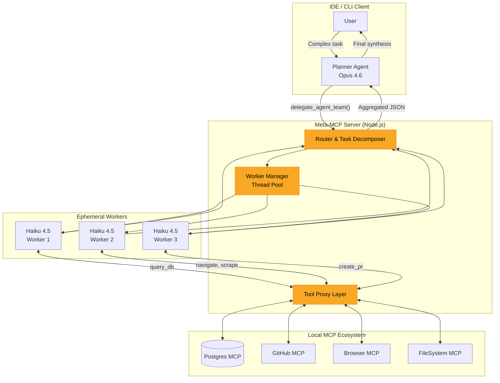
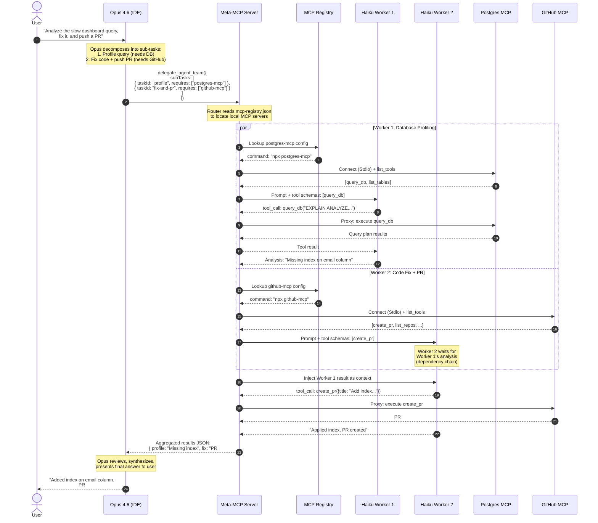
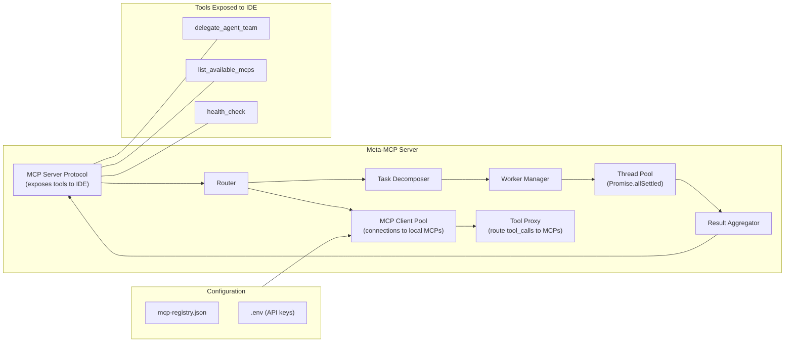
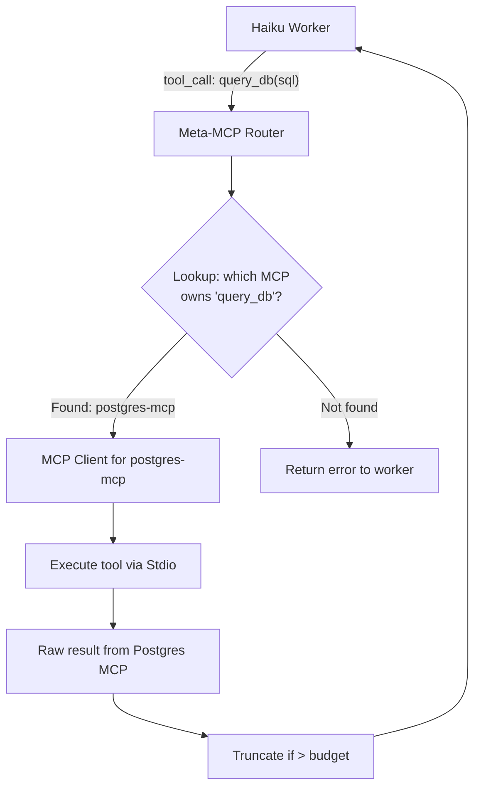
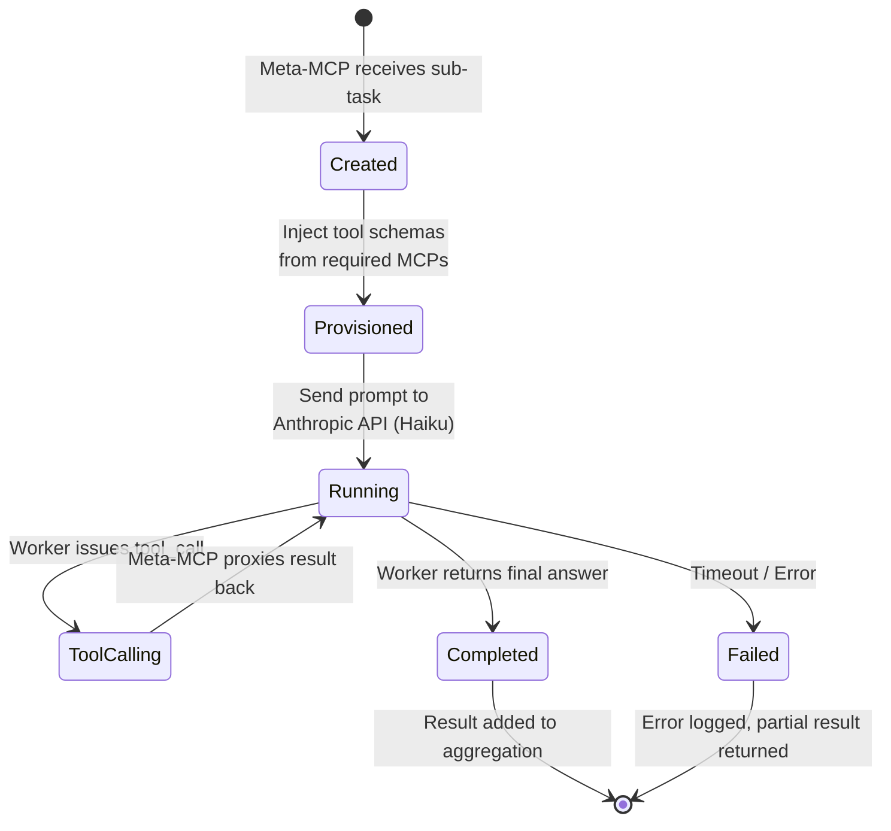

# Prompt Plan: Meta-MCP Orchestrator

> **Goal:** Build a local Node.js MCP server that acts as a dynamic router and tool provisioner — spawning parallel lightweight LLM workers equipped with specific MCP tools to execute complex, multi-domain tasks.
>
> **Reference spec:** [meta-mcp-orchestrator-spec.md](meta-mcp-orchestrator-spec.md)
> **Complementary system:** [PromptBooster Enhancement Spec](promptbooster-enhancement-spec.md)

---

## System Architecture



---

## End-to-End Execution Flow



---

## Component Architecture



---

## Tool Proxy Flow (per worker)



---

## Worker Lifecycle



---

## Implementation Phases

### Phase 1 — Core Server Scaffold

```
meta-mcp-orchestrator/
├── src/
│   ├── index.ts                  # MCP Server entry point
│   ├── config/
│   │   └── registry.ts           # Load mcp-registry.json
│   ├── router/
│   │   └── taskRouter.ts         # Route sub-tasks to workers
│   ├── workers/
│   │   └── workerManager.ts      # Spawn & manage Haiku workers
│   ├── proxy/
│   │   └── mcpClientPool.ts      # Connect to local MCPs as client
│   │   └── toolProxy.ts          # Route tool_calls to correct MCP
│   └── tools/
│       └── delegateAgentTeam.ts   # Main tool schema + handler
├── mcp-registry.json             # Maps server names → commands
├── package.json
└── .env                          # ANTHROPIC_API_KEY
```

**Tasks:**

- [ ] Initialize Node.js project with `@modelcontextprotocol/sdk` and `@anthropic-ai/sdk`
- [ ] Implement MCP Server protocol (expose `delegate_agent_team` tool)
- [ ] Implement `mcp-registry.json` parser
- [ ] Test: server starts, exposes tool schema to IDE

### Phase 2 — MCP Client Pool & Tool Proxy

**Tasks:**

- [ ] Implement `mcpClientPool.ts` — connect to local MCPs via Stdio
- [ ] Implement `toolProxy.ts` — intercept worker `tool_call`, route to correct MCP
- [ ] Implement tool schema fetching (`list_tools`) from each connected MCP
- [ ] Test: proxy a `query_db` call from worker → Postgres MCP → result back

### Phase 3 — Worker Manager & Parallel Execution

**Tasks:**

- [ ] Implement `workerManager.ts` — spawn Haiku workers via Anthropic API
- [ ] Inject tool schemas into worker prompts
- [ ] Handle multi-turn tool_call loop (worker calls tool → proxy → result → worker continues)
- [ ] Implement `Promise.allSettled` parallel execution
- [ ] Implement timeout per worker (default: 30s)
- [ ] Test: 2 parallel workers, each using a different local MCP

### Phase 4 — Result Aggregation & Error Handling

**Tasks:**

- [ ] Implement result aggregation (JSON summary per sub-task)
- [ ] Handle worker failures gracefully (partial results)
- [ ] Handle dependency chains (worker B depends on worker A's output)
- [ ] Add logging and metrics (execution time, token usage per worker)
- [ ] Test: sub-task failure doesn't block other workers

### Phase 5 — IDE Integration & PromptBooster Synergy

**Tasks:**

- [ ] Register Meta-MCP in `.vscode/mcp.json` for VS Code
- [ ] Register Meta-MCP via `claude mcp add` for Claude Code
- [ ] Add system prompt guidance for Planner (when to delegate vs. do directly)
- [ ] Test combined flow: PromptBooster enhanced prompt → Agent delegates → Meta-MCP executes
- [ ] Document: setup guide for end users

---

## Configuration: `mcp-registry.json`

```json
{
  "servers": {
    "postgres-mcp": {
      "command": "npx",
      "args": ["-y", "@modelcontextprotocol/server-postgres"],
      "env": { "DATABASE_URL": "${DATABASE_URL}" }
    },
    "github-mcp": {
      "command": "npx",
      "args": ["-y", "@modelcontextprotocol/server-github"],
      "env": { "GITHUB_TOKEN": "${GITHUB_TOKEN}" }
    },
    "browser-mcp": {
      "command": "npx",
      "args": ["-y", "@anthropic-ai/mcp-server-puppeteer"]
    },
    "filesystem-mcp": {
      "command": "npx",
      "args": ["-y", "@modelcontextprotocol/server-filesystem", "/workspace"]
    }
  }
}
```

---

## Metrics: Before vs. After

```mermaid
graph LR
    subgraph Before["Single Agent (Opus Only)"]
        direction TB
        B1["Sequential tool calls"]
        B2["100k+ tokens consumed"]
        B3["Context pollution"]
        B4["4-5 min per complex task"]
        B5["~$0.80 per task"]
    end

    subgraph After["Meta-MCP (Opus + Haiku Workers)"]
        direction TB
        A1["Parallel tool calls"]
        A2["<10k tokens (Opus)"]
        A3["Isolated worker contexts"]
        A4["~45s per complex task"]
        A5["~$0.20 per task"]
    end

    Before -.->|Improvement| After

    style Before fill:#ef5350,stroke:#c62828,color:#fff
    style After fill:#66bb6a,stroke:#388e3c,color:#fff
```



| Metric | Single Agent | Meta-MCP | Improvement |
|---|---|---|---|
| Execution | Sequential | Parallel | ~5x faster |
| Context (Planner) | 100k+ tokens | <10k tokens | 90% reduction |
| Cost | ~$0.80 | ~$0.20 | 75% cheaper |
| Hallucination risk | Medium-High | Near zero | Isolated contexts |
| IDE tool bloat | 50+ tools visible | 1 tool (`delegate_agent_team`) | Clean UX |

---

## Risks & Mitigations

| Risk | Mitigation |
|---|---|
| Local MCP server crashes mid-execution | Worker timeout + graceful error in aggregated result |
| Anthropic API rate limits | Configurable concurrency cap (default: 3 parallel workers) |
| Worker produces incorrect output | Planner (Opus) reviews all results before synthesizing |
| Sensitive data in worker context | Workers only receive files/schemas explicitly listed in sub-task |
| MCP Stdio connection issues | Retry with backoff; fall back to error message in result |

---

## Success Criteria

1. `delegate_agent_team` tool appears in IDE when Meta-MCP server is registered
2. 3 parallel Haiku workers complete within 60s total for a multi-domain task
3. Each worker only sees tools from its `required_mcp_servers` — no cross-contamination
4. Planner receives clean JSON aggregation and produces coherent final answer
5. Cost per complex task is <30% of equivalent single-agent execution
