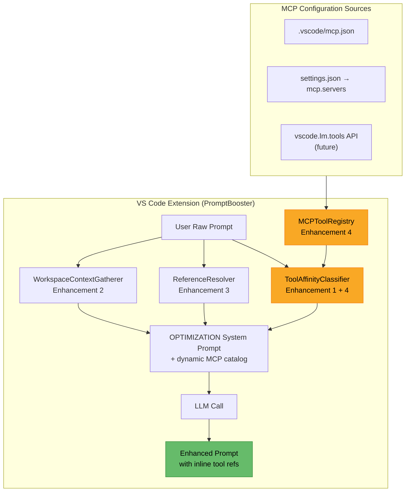
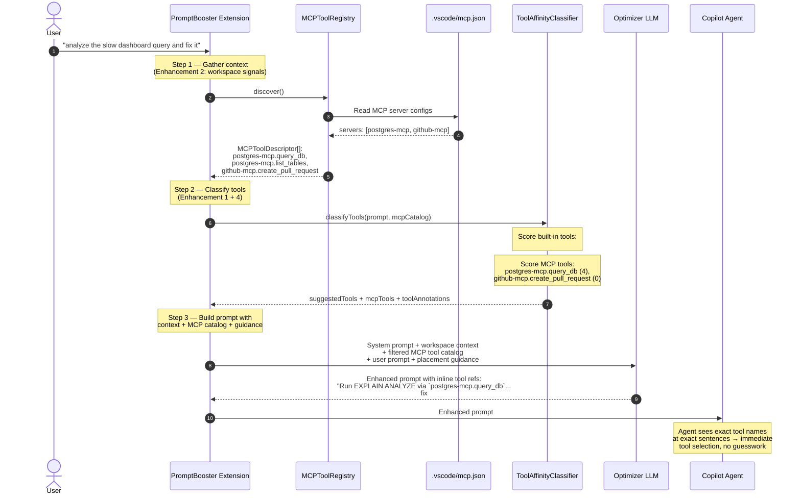
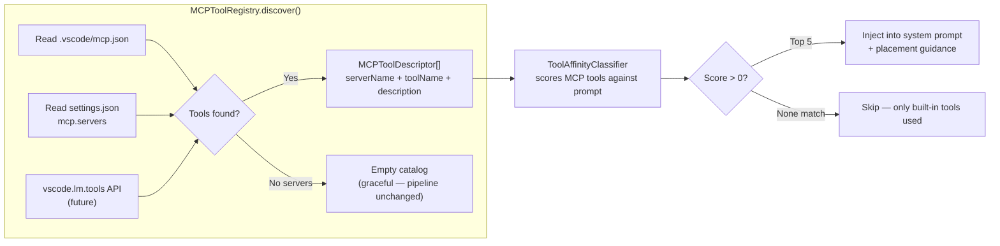
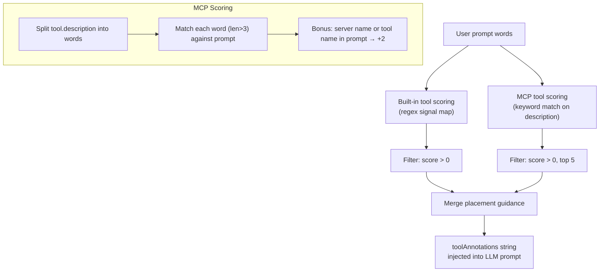

# Prompt Plan: PromptBooster MCP-Aware Tool Provisioning

> **Goal:** Enable PromptBooster to discover user-configured MCP servers and weave their tool references into enhanced prompts — so the downstream agent immediately picks the best tool.
>
> **Reference spec:** [promptbooster-enhancement-spec.md](promptbooster-enhancement-spec.md) — Enhancement 4

---

## Architecture Overview



---

## Data Flow (Sequence)



---

## MCP Tool Discovery Flow



---

## Classification Scoring Logic



---

## Implementation Phases

### Phase 4a — MCP Config Discovery

```
MCPToolRegistry.ts
├── discoverFromMcpJson()      → parse .vscode/mcp.json
├── discoverFromSettings()     → parse workspace settings
├── discoverFromRuntime()      → vscode.lm.tools (future, no-op now)
├── getToolCatalog()           → MCPToolDescriptor[]
└── formatForSystemPrompt()    → compact string for LLM injection
```

**Tasks:**

- [ ] Create `src/core/services/MCPToolRegistry.ts`
- [ ] Register `TYPES.MCPToolRegistry` in DI container
- [ ] Inject into `RealtimeModeStrategy` constructor
- [ ] Unit test: parsing `.vscode/mcp.json` with 0, 1, 5 servers
- [ ] Unit test: deduplication across config sources

### Phase 4b — Extended Classification

**Tasks:**

- [ ] Extend `classifyTools()` signature to accept `mcpCatalog` param
- [ ] Add keyword-matching scorer for MCP tool descriptions
- [ ] Add server/tool name bonus scoring
- [ ] Hard cap at top 5 MCP tools per request
- [ ] Merge MCP placement guidance with built-in guidance
- [ ] Unit test: prompt "query the database" → matches `postgres-mcp.query_db`
- [ ] Unit test: prompt "fix the bug" → zero MCP matches, only built-in

### Phase 4c — Prompt Integration

**Tasks:**

- [ ] Inject filtered MCP catalog into `buildPromptWithContext()`
- [ ] Extend `PromptResult` with `mcpTools?` field
- [ ] Update `renderInteractiveResponse()` to show MCP tool tags
- [ ] Integration test: end-to-end with mock MCP config

---

## Risks & Mitigations

| Risk | Mitigation |
|---|---|
| MCP tool schemas aren't always well-described | Fall back to server name + tool name matching |
| Too many tools overwhelm the classifier | Hard cap at top 5; weight by description match quality |
| VS Code MCP API isn't stable yet | Start with config file parsing; add runtime API later |
| Enhanced prompt references a tool the agent can't access | Only reference tools from user's own MCP config |
| Config parsing fails | Graceful fallback — empty catalog, pipeline unchanged |

---

## Success Criteria

1. With `postgres-mcp` and `github-mcp` configured, a prompt mentioning "database" and "PR" produces an enhanced prompt containing `postgres-mcp.query_db` and `github-mcp.create_pull_request` inline
2. With zero MCP servers configured, output is identical to Enhancement 1–3 alone
3. Classification adds <5ms latency (keyword matching, no LLM call)
4. No more than 5 MCP tools injected per request regardless of catalog size
