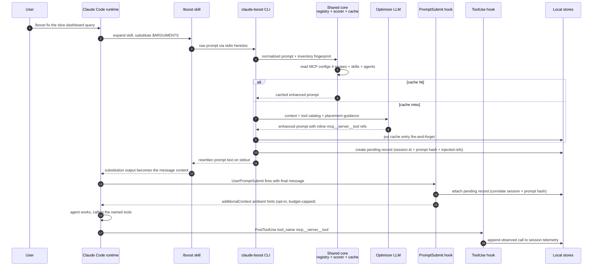

# Design Spec: Porting PromptBooster to Claude Code

> **Status:** **Approved for implementation — decisions recorded 2026-09-09** (section 10).
> No source files were modified by the design pass; the first M1 task re-verifies the section 2
> facts. This document is self-contained: it explains what PromptBooster is, what changes when
> the mechanism moves to Claude Code, and why.
> **Related:** [promptbooster-enhancement-spec.md](../promptbooster-enhancement-spec.md) (mechanism definition),
> [mcp-aware-tool-provisioning-v2.md](mcp-aware-tool-provisioning-v2.md) (v2.1 architecture this port reuses).

---

## 1. Executive summary

PromptBooster is a VS Code extension that intercepts the user's rough prompt before it reaches
GitHub Copilot: a chat participant (`@PromptBooster`) captures the prompt, the extension discovers
which tools the environment actually offers (VS Code built-ins plus MCP servers registered in
`.vscode/mcp.json` and settings), scores those tools against the prompt, and asks an optimizer LLM
to rewrite the prompt with the winning tool references woven inline — so the downstream agent
reaches for the right tool on the first turn instead of probing. The v2.1 plan adds a discovery
waterfall (runtime API > probe cache > manual index > inline schema > stub), visibility gating,
a precision-focused scorer, an optimizer-response cache, and an acceptance-based feedback loop.

This spec designs the port of that mechanism to **Claude Code** (Anthropic's CLI agent), packaged
as a Claude Code **plugin**: a `/boost` skill for the rewrite UX, hooks for ambient context and
tool-usage telemetry, and file-backed cache/learning stores.

**Headline finding — the port is asymmetric:**

- **The measurement side gets *better*.** VS Code could only proxy tool usefulness through chat-UI
  acceptance buttons (weak labels, per-ref unknowable) and a best-effort `request.toolCalls`
  side channel. Claude Code's `PreToolUse`/`PostToolUse`/`PostToolBatch` hooks emit every real
  tool invocation — including MCP tools under their exact runtime names (`mcp__<server>__<tool>`)
  — with inputs and durations. That is direct, per-reference ground truth the VS Code design
  never had. The v2.1 feedback loop's weakest assumption (labels are proxies) disappears.
- **The rewrite side gets *harder*.** Claude Code's `UserPromptSubmit` hook can inject context and
  block, but **cannot replace or rewrite the submitted prompt** — the docs state this explicitly.
  PromptBooster's core gesture (intercept → rewrite → substitute) has no native equivalent. The
  port must route the rewrite through a skill whose bash substitution runs *before* Claude sees
  the content (`/boost <rough prompt>`), with context-injection and Agent-SDK variants as
  complements. Section 4 analyzes the four options.

Secondary findings: MCP discovery is *easier* (four documented config scopes, plain JSON files,
no proposed-API roulette); reference fidelity is *easier* (rewrites can embed the literal
`mcp__server__tool` runtime name, eliminating the v2 semantic-vs-runtime mapping caveat); and
`src/core/**` — deliberately vscode-free — is reusable almost verbatim behind new Node-based
adapters for the existing ports (section 7).

---

## 2. Verified facts — Claude Code extension surface

> **Caveat:** These facts were verified on **2026-09-06** against the official docs at
> `code.claude.com` and a local Claude Code CLI **2.1.232**. Claude Code's extension surface is
> evolving quickly (see the output-style removal precedent in section 9). **Every fact below must
> be re-verified immediately before implementation begins** — treat this section as a research
> snapshot, not a contract.
>
> Primary doc URLs (valid as of the research date):
> Hooks: https://code.claude.com/docs/en/hooks and https://code.claude.com/docs/en/hooks-guide ·
> Plugins: https://code.claude.com/docs/en/plugins and https://code.claude.com/docs/en/plugins-reference ·
> Marketplaces: https://code.claude.com/docs/en/plugin-marketplaces ·
> Skills: https://code.claude.com/docs/en/skills ·
> Slash commands: https://code.claude.com/docs/en/slash-commands ·
> Subagents: https://code.claude.com/docs/en/sub-agents ·
> MCP: https://code.claude.com/docs/en/mcp ·
> Headless mode: https://code.claude.com/docs/en/headless ·
> Agent SDK: https://code.claude.com/docs/en/sdk ·
> Data usage/retention: https://code.claude.com/docs/en/data-usage

1. **`UserPromptSubmit` hook** — receives stdin JSON with `prompt` (the exact submitted text),
   `session_id`, `prompt_id`, `transcript_path`, `cwd`. **Can:** inject context (plain stdout, or
   JSON `{"hookSpecificOutput": {"hookEventName": "UserPromptSubmit", "additionalContext": "..."}}`
   — the nesting inside `hookSpecificOutput` is required, and `additionalContext` is capped at
   **10,000 characters**) and block the prompt (exit 2, or `{"decision": "block", "reason": "..."}`).
   **Cannot:** replace or rewrite the prompt — docs state this explicitly. Default timeout 30 s.
2. **`PreToolUse`/`PostToolUse` hooks** — input includes `tool_name`, `tool_input`,
   `tool_use_id`; `PostToolUse` adds `tool_response` + `duration_ms` and fires only on success
   (`PostToolUseFailure` exists for failures). MCP tools fire too, named
   `mcp__<server>__<tool>` (plugin-bundled servers: `mcp__plugin_<plugin>_<server>__<tool>`);
   server-wide matchers need regex (e.g. `mcp__memory__.*`). **`PostToolBatch`** receives the
   whole parallel batch as a `tool_calls` array. This is a reliable observed-tool-usage telemetry
   stream — strictly better ground truth than PromptBooster's VS Code acceptance buttons.
3. **Plugins** — bundle `skills/`, `commands/`, `agents/`, `hooks/hooks.json`, `.mcp.json`,
   `output-styles/` under a root containing `.claude-plugin/plugin.json` (component dirs sit at
   the plugin root, **not** inside `.claude-plugin/`). Distribution via marketplace
   (`/plugin marketplace add <owner/repo>` → `/plugin install`) or local dev
   (`claude --plugin-dir <path>`); `claude plugin validate` checks structure.
4. **Prompt-rewrite options** (since in-place rewriting is impossible): (a) skill/slash-command
   with `$ARGUMENTS` + `` !`command` `` bash substitution — the shell runs **before** Claude sees
   the content, so `/boost <rough prompt>` can interpolate the rewritten prompt; (b)
   `UserPromptSubmit` `additionalContext` alongside the original; (c) **Agent SDK** streaming
   input mode — host the loop and rewrite every user message before yielding (full-fidelity port
   of the VS Code extension model; Claude Code runs embedded); (d) headless `claude -p` +
   `--resume <session_id>` with rewritten text as the next turn.
5. **Transcripts** — `~/.claude/projects/<encoded-project-path>/<session-id>.jsonl`; every
   message/tool call/result. **Not** a documented public schema; retention governed by
   `cleanupPeriodDays` (default 30). The documented machine-readable alternative is
   `claude -p --output-format stream-json`, whose `system/init` event includes `mcp_servers`.
   Hooks receive `transcript_path`, but the file may lag the live conversation.
6. **Config/inventory** — MCP scopes: Local (`~/.claude.json` under
   `projects["<path>"].mcpServers`), Project (`.mcp.json` at repo root), User (`~/.claude.json`),
   plugin (plugin's `.mcp.json`). Precedence **Local > Project > User > Plugin**; on name
   collision the whole entry wins (no field merge). `claude mcp list` is **not** machine-readable
   (no `--json`) — read config files directly or use the stream-json init event. Skills live in
   `~/.claude/skills/`, `.claude/skills/`, plugin `skills/`; subagents in `.claude/agents/`,
   `~/.claude/agents/`, plugin `agents/`.
7. **Native overlap** — nothing official rewrites prompts. Output styles modify the system prompt
   only (and `/output-style` was **deprecated in v2.1.73 and removed in v2.1.91** — churn
   precedent). CLAUDE.md adds a user message after the system prompt.

---

## 3. Mechanism mapping — PromptBooster → Claude Code

| # | PromptBooster mechanism (VS Code) | Claude Code equivalent | Verdict |
|---|---|---|---|
| 1 | Chat participant `@PromptBooster` captures the prompt | `/boost` skill invocation (`$ARGUMENTS`), or ambient `UserPromptSubmit` hook (fires on every prompt, no gesture needed) | **Comparable** — plus ambient coverage VS Code lacked |
| 2 | Rewrite rendered in-chat; user applies via buttons | **Impossible natively.** `UserPromptSubmit` cannot replace the prompt. Workaround: skill bash substitution outputs the rewritten text as the message Claude acts on | **Harder** — the central constraint (section 4) |
| 3 | Workspace context: active file, cursor, diagnostics, git branch | No editor host. Signals reduce to `cwd`, git state, file tree, `package.json`, recent shell history if user opts in | **Harder** — weaker preamble, different signal set |
| 4 | `#file` / `#selection` reference tokens resolved by the extension | Claude Code has native `@`-file mentions; no selection concept in a terminal | **N/A → easier** — lean on native mentions, drop the token resolver |
| 5 | MCP config discovery (`.vscode/mcp.json`, settings, foreign configs) | Four documented scopes (Local/Project/User/Plugin) as plain JSON files; precedence documented | **Easier** — documented, machine-readable, no proposed API |
| 6 | Runtime tool enumeration (`vscode.lm.tools`, proposed API) | `claude -p --output-format stream-json` `system/init` → `mcp_servers`; or the existing `McpServerProbe` (already host-agnostic) | **Easier** — documented surface; probe is reusable as-is |
| 7 | Reference format mismatch (`server.tool` semantic vs `mcp_*` runtime IDs) | Rewrites embed the **literal** `mcp__server__tool` runtime name | **Easier** — exact fidelity; F2's mapping caveat evaporates |
| 8 | Visibility gating (foreign = other agents' servers) | Same downstream agent (Claude Code) executes all four of its own scopes; "foreign" shrinks to other editors' configs, which the port simply does not read | **Easier** — policy simplifies to "own scopes only" |
| 9 | Acceptance buttons = weak proxy labels | Observed `PostToolUse` calls = direct per-tool usage ground truth | **Much better** |
| 10 | `request.toolCalls` (feature-detect, best-effort) | Full hook telemetry: `tool_name`, `tool_input`, `tool_response`, `duration_ms`, batches | **Much better** |
| 11 | Optimizer LLM via VS Code `lm.chat` API | No LM API available to a CLI — needs own provider: an API key, or headless `claude -p` as the optimizer (no separate key) | **Harder** — new decision (section 10) |
| 12 | Extension workspace/global state | Local JSON files under a plugin-owned data dir (no state API) | **Comparable** — DIY persistence with file permissions |
| 13 | Response cache + learning loop | Same core logic, file-backed stores | **Same** — logic ports, storage swaps |
| 14 | Distribution: VSIX / VS Code marketplace | Plugin marketplace, or `--plugin-dir` for local dev | **Comparable** — younger ecosystem, lighter review story |

---

## 4. The prompt-rewrite constraint and the four options

**The constraint.** Everything PromptBooster does ultimately funnels into one act: replacing the
user's rough text with a better version *that the downstream model receives as the prompt*. In
VS Code the participant controls the rendered chat content, so substitution is trivial. In Claude
Code, the submitted prompt is untouchable from `UserPromptSubmit` — the only levers are
*adding context around it* or *blocking it*. Any port must therefore choose where the rewritten
text enters the pipeline.

| Option | Mechanism | Fidelity | Latency | Invasiveness | Key failure modes |
|---|---|---|---|---|---|
| **A. `/boost` skill** (recommended primary) | User types `/boost <rough prompt>`; skill markdown runs `` !`claude-boost …` `` with `$ARGUMENTS`; the shell executes **before** Claude sees the content, so the rewritten prompt *is* the message | High — the model's effective prompt is the rewrite | One optimizer-LLM round-trip before the turn starts (cache-mitigated) | None — no ambient behavior, strictly opt-in per prompt | Shell quoting of arbitrary prompt text (mitigated below); user must remember to type `/boost` |
| **B. `UserPromptSubmit` context injection** (recommended ambient complement) | Hook injects budget-capped `additionalContext` next to the *original* prompt: learned hints, compact tool-catalog hints | Medium — original text stays; hints steer, not replace | Hook budget (30 s timeout; target < 1 s) | Ambient — touches every prompt; must be cheap, silent, capped | 10,000-char cap; noise if hints are wrong; user cannot see what was injected unless told |
| **C. Agent SDK streaming input** (documented escape hatch) | Host app embeds Claude Code via the Agent SDK, rewrites every user message before yielding it to the loop — the literal VS Code extension model, full fidelity | Highest — every message rewritten, loop fully controlled | Host-owned | Requires owning the host app — this is "build a product on the SDK," not "install a plugin" | Out of scope for a plugin; separate deliverable if ever needed |
| **D. Headless `--resume`** | `claude -p` per turn; rewrite and feed via `--resume <session_id>` | High per-turn | Process per turn | Scripted/automation contexts only | Not interactive; niche |

**Recommendation.** Build **A as the primary UX** (closest native interactive match: the shell
substitution happens pre-model, which is exactly the interception point PromptBooster needs) and
**B as ambient augmentation** (hints improve *unboosted* prompts at zero user cost — something the
VS Code extension never offered). Document **C** as the full-fidelity escape hatch for anyone who
wants the exact VS Code model and is willing to host the loop; **D** is noted for CI/automation
but not built in the first three milestones.

**Option A quoting detail (load-bearing).** `$ARGUMENTS` is substituted textually before the
shell runs, so raw prompts containing quotes, `$`, backticks, or newlines will break a naive
`` !`claude-boost "$ARGUMENTS"` `` wrapper. The skill should pass the prompt via **stdin with a
quoted heredoc** so the shell never interprets the content:

```
!`claude-boost --stdin <<'PB_PROMPT_EOF'
$ARGUMENTS
PB_PROMPT_EOF`
```

A sentinel line inside the user's prompt is the residual edge case (accept it; pick an unlikely
delimiter). **Verify at M1** that multi-line heredocs inside `` !`…` `` substitution are supported
by the current CLI; the single-line quoted form is the fallback.

---

## 5. Plugin blueprint

### Directory layout

```
packages/claude-code-plugin/              # monorepo package (decision 10.1; mechanics in section 7)
  .claude-plugin/
    plugin.json                           # manifest: name, version, description, author
  skills/
    boost/SKILL.md                        # PRIMARY UX — /boost <rough prompt>
    boost-report/SKILL.md                 # feedback/cache report surface
  hooks/
    hooks.json                            # registers the three hook handlers below
    dist/                                 # compiled, dependency-free Node bundles (esbuild)
      prompt-submit-hook.js               # UserPromptSubmit  — session record + ambient hints
      tool-use-hook.js                    # PostToolUse/PostToolBatch — telemetry append
      boost-cli.js                        # claude-boost — the rewrite engine entry point
  .mcp.json                               # NOT shipped in M1–M3 (no MCP server of our own)
```

Notes: `commands/` (classic slash-commands) is an acceptable alternative carrier for `/boost` if
skill semantics shift — keep the content portable between the two. `output-styles/` is
deliberately **not** used (system-prompt-only surface, removal precedent). `agents/` is not needed.

### Components

| Component | Event / trigger | Responsibility |
|---|---|---|
| `/boost` skill (`skills/boost/SKILL.md`) | user invocation | Wraps the `claude-boost` CLI via `$ARGUMENTS` + heredoc stdin substitution (section 4); instructs Claude that the stdout block is the operative prompt |
| `claude-boost` CLI (`hooks/dist/boost-cli.js`) | invoked by the skill's bash substitution | The rewrite engine: gather inventory (4 MCP scopes + skills + agents), fingerprint it, consult response cache, run scorer, call optimizer LLM, print rewritten prompt; create the pending session record |
| Prompt-submit hook | `UserPromptSubmit` | (1) Create/attach the pending record for boosted turns (correlate `session_id` + prompt hash); (2) ambient mode: inject budget-capped learned hints + catalog hints via `additionalContext` (opt-in) |
| Tool-use hook | `PostToolUse` + `PostToolBatch` | Append observed tool calls to the session's telemetry log — append-only JSONL, no aggregation at fire time. **Persists only `tool_name` (incl. `mcp__server__tool`), `tool_use_id`, `duration_ms`, `timestamp` — never `tool_input`/`tool_response`** (tool inputs carry file contents and credentials) |
| Inventory provider (inside `claude-boost`) | on demand | Reads `~/.claude.json` (Local + User scopes), `.mcp.json` (Project), plugin `.mcp.json`; enumerates skills + agents dirs; computes the inventory fingerprint |
| Cache store | on demand | Optimizer-output cache (LRU + TTL), keyed per section 6 — file-backed under the plugin data dir, `0600` |
| Learning store | on demand | Confirmed-positive selection → bounded opt-in few-shot block (v2.1 logic, file-backed) |
| `/boost-report` skill | user invocation | Funnel counts, observed-usage precision, per-ref retention, cache hit rate |

**Storage layout (single source of truth for all state — verify no official per-plugin data dir
exists at M1; otherwise claim `~/.claude/promptbooster/`):**

```
~/.claude/promptbooster/
  cache.json                # optimizer response cache (prompts may contain secrets → 0600, never committed)
  telemetry/<session>.jsonl # append-only tool calls per session (name/id/duration/timestamp only — never inputs/responses)
  feedback.json             # pending + resolved records
  learning.json             # confirmed positives / few-shot selection inputs
  settings.json             # plugin options (no VS Code-style settings contribution exists)
```

### Data flow



Correlation design: `claude-boost` cannot see `session_id`, and the hooks cannot know a boost
happened except by the message content. The pending record stores a hash of the rewritten prompt;
the `UserPromptSubmit` hook matches `sha256(prompt)` against outstanding pending records for its
`session_id` and links them. Mismatch (user edited the rewrite, record expired) degrades to an
unlinked telemetry session — never an error.

---

## 6. Feedback loop in Claude Code terms

### Labels: observed usage replaces the acceptance proxy

v2.1's weakest link was that labels were proxies: "accept" meant the user clicked a button, and
per-reference retention had to be inferred from final text. Claude Code gives direct evidence:

| Signal | Source | Label semantics |
|---|---|---|
| Injected ref `mcp__s__t` observed in `PostToolUse` during the session | tool-use hook | `used-strong` — the rewrite caused (or at minimum coincided with) a real call to exactly the referenced tool |
| Injected ref never observed by session end | absence | **No label.** Absence of a call is not evidence of a bad reference (task may not have needed it) — same conservative stance as v2.1's `edit-opened` |
| Non-injected tool observed | tool-use hook | Funnel signal — the scorer missed something the agent wanted (recall diagnostics only) |
| `/boost` invoked, user then re-submits a different prompt (block-and-retry path) | optional | Out of scope for M1–M3 |

Resolution timing: telemetry resolves **lazily** — at `/boost-report` time or pending-TTL expiry —
rather than depending on a session-end hook. If a `SessionEnd` hook exists at build time
(verify; not part of the section 2 snapshot), use it to accelerate resolution, never as a
dependency.

### Cache key

```
cacheKey = sha256(
  [
    "pb-cc-cache-v1",                 // key-schema version
    normalizeWhitespace(rawPrompt),    // trim + collapse \s+ — same rule as v2.1, not lowercased
    inventoryFingerprint,              // see below
    OPTIMIZER_PROMPT_VERSION,          // shared const with the VS Code extension
    fewShotStamp,                      // "" when few-shot off; else sha256 of selected examples
  ].join(String.fromCharCode(0))
)

inventoryFingerprint = sha256 over
  [ localScopeMcp  (~/.claude.json projects[cwd].mcpServers — path+mtimeMs+size),
    projectMcp     (.mcp.json),
    userMcp        (~/.claude.json mcpServers),
    pluginMcp      (plugin .mcp.json),
    skillsListing  (names + mtimes of ~/.claude/skills, .claude/skills, plugin skills),
    agentsListing  (names + mtimes of .claude/agents, ~/.claude/agents, plugin agents) ]
```

Rationale vs. v2.1: the VS Code key used the MCP catalog fingerprint alone because that was the
only injectable inventory. Here the rewrite also names **skills and subagents** ("delegate the
schema diff to the `reviewer` subagent"), so they belong in the key. File-per-scope hashing keeps
multi-MB `~/.claude.json` parses off the hot path via mtime short-circuiting (the v2.1 5 MB parse
cap carries over as the fallback posture). `pluginVersion` is deliberately **not** a fingerprint
input (review delta, 2026-09-09): `OPTIMIZER_PROMPT_VERSION` already invalidates the cache when
optimizer behavior changes, and a plugin release that didn't touch the optimizer shouldn't evict
every entry.

### Learning output injection

Confirmed positives (≥ 1 `used-strong` ref, or verbatim re-submission of a cached rewrite) feed
the same bounded few-shot mechanism as v2.1 — same caps (5 examples / 2,000 chars), same
**opt-in, default OFF** posture, same "never promote a rejection" rule. Injection channel in
Claude Code, in preference order:

1. **`additionalContext` on `UserPromptSubmit`** (ambient mode) — budget: learned block ≤ 1,500
   chars, catalog hints ≤ 1,500 chars, combined hard-checked against the 10,000-char cap with
   headroom for the runtime's own injections.
2. **Inside the `/boost` skill payload** (boosted mode) — the few-shot block rides along in the
   optimizer input, identical to v2.1; no cap interplay because it never touches the hook channel.

Privacy defaults are unchanged from v2.1: everything stays in local `0600` files under the plugin
data dir; few-shot (which re-sends accepted prompts to a model provider) is opt-in; the report
command reads only local stores.

Cross-host semantics (decision 10.6): learning stores stay **per-host** — the VS Code extension's
workspace state and the plugin's `learning.json` never merge. Standing rule, recorded so it needs
no re-litigation: if unification is ever introduced, `used-strong` (observed call) ranks above
v2.1's `retained-strong` (retained text) in promotion priority.

---

## 7. Architecture reuse — what ports, what adapts

The v2 architecture already separates the mechanism (`src/core/**`, vscode-free by rule) from the
host (`src/infrastructure/vscode/**`). The port is therefore mostly **new adapters over existing
ports**, plus one composition root.

**Monorepo mechanics (decision 10.1).** The plugin package lives at
`packages/claude-code-plugin/`, but **no `packages/core` extraction happens in M1–M3**: the
plugin's esbuild bundles compile the root tree's `src/core/**` sources directly via tsconfig
path aliases, and the VS Code extension stays exactly where it is. Extraction is a mechanical
follow-up (the vscode-free boundary is already enforced) deferred until a third consumer appears
— moving every extension import now would re-plumb vsce/test-electron right after the v2
stabilization, for zero current value.

### Genuinely shared (reuse verbatim from `src/core`)

| Core asset | Why it ports cleanly |
|---|---|
| `ToolAffinityClassifier` (scorer v2) | Pure function of prompt text + descriptors; zero host dependency |
| `McpServerProbe` | Protocol logic over `IMcpProcessTransport`; never touches vscode |
| `PromptResponseCache` logic | Key formula + LRU/TTL policy are storage-agnostic (swap `IStateRepository` implementation) |
| `PromptLearningStore` selection logic | Same — pure policy over records |
| Feedback label derivation | Pure functions (record + observations → labels); unit-testable identically |
| `core/prompts/SystemPrompts.ts` | Optimizer prompt is host-neutral; `OPTIMIZER_PROMPT_VERSION` is shared so cache keys stay mutually meaningless across hosts (different schema tags) but internally consistent |
| `shared/types/McpToolTypes.ts` | Descriptor/source/visibility model carries over; Claude Code sources map to `McpConfigSource` values (`claude-code-global`, `claude-code-workspace` already exist as enum members — they become *primary* instead of *foreign*) |

### Host-specific (rewrite, do not port)

- `WorkspaceContextGatherer` — every signal is a vscode API. Claude Code variant gathers: `cwd`,
  git branch/status, shallow file tree, `package.json`/manifest detection. New, smaller service.
- `ReferenceResolver` — `#file`/`#selection` are VS Code chat variables. Claude Code's native
  `@`-mentions make this layer unnecessary; drop it.
- `RealtimeModeStrategy` / `IModeStrategy` — the chat-participant model has no analog; the flow is
  replaced by skill-CLI + hooks. Do not force the strategy pattern onto it.
- All of `src/presentation/**` and `src/infrastructure/vscode/**`.

### Port-by-port adapter plan

| Port (in `src/shared/interfaces/`) | VS Code adapter | Claude Code adapter |
|---|---|---|
| `IMcpEnvironmentProvider` | `VSCodeMcpEnvironmentProvider` | `ClaudeCodeMcpEnvironmentProvider` — `getWorkspaceFolderPath()` → hook `cwd`/`process.cwd()`; `getVsCodeServerSettings()` → Local-scope `~/.claude.json` entry (shape-compatible: `{command, args, env}`); `getVsCodeDisabledServers()` → `disabledMcpjsonServers` keys; `getHomeDirPath()` → `os.homedir()` |
| `IMcpRuntimeToolsProvider` | guarded `vscode.lm.tools` | `StreamJsonRuntimeToolsProvider` — spawn `claude -p --output-format stream-json`, read `system/init` `mcp_servers`; `isAvailable()` = CLI on PATH + version check; runtime names already parse as `mcp__server__tool` |
| `IMcpProcessTransport` | `ChildProcessMcpTransport` | **reused as-is** — it is `child_process`-based, already vscode-free |
| `IConfigChangeWatcher` | `VSCodeConfigWatcher` (FileSystemWatcher) | `NodeConfigWatcher` — `fs.watch` over the four config paths + skills/agents dirs, debounced |
| `IStateRepository` | `StateRepository` (globalState/workspaceState) | `FileStateRepository` — JSON files under `~/.claude/promptbooster/`. **Note:** the interface currently lives inside `src/infrastructure/state/StateRepository.ts`, not `shared/interfaces/` — lifting it to `shared/interfaces/IStateRepository.ts` is a prerequisite refactor (mechanical, interface unchanged) |
| `IFileSystem` | `VSCodeFileSystem` | `NodeFileSystem` — **note:** the shared interface signature accepts `string \| vscode.Uri` and imports `vscode`; widen to string-only (Uri is a subtype of the use case) or introduce a string-only `INodeFileSystem`. Prerequisite refactor, same spirit as the v2 layering fix |
| `IConfigurationManager` | `ConfigurationManager` (workspace settings) | `PluginSettingsManager` — reads `~/.claude/promptbooster/settings.json`; plugins have no settings-contribution mechanism. Needs the v2.1 option methods (`getMcpProvisioningOptions`, `getFeedbackLearningOptions`) with Claude-Code-appropriate defaults |

### DI wiring (explicit)

Every new service gets a symbol and a registration — in the **new package's own composition
root** (`packages/claude-code-plugin/src/di/{types,Registry}.ts`), following the repo's
symbol-keyed locator convention, **not** by polluting the VS Code extension's
`src/di/ServiceRegistry.ts`. New symbols (all `Symbol.for(...)`-style, mirroring `src/di/types.ts`):

```
// adapters (infrastructure/node/)
NodeMcpEnvironmentProvider, StreamJsonRuntimeToolsProvider,
NodeProcessTransport (rebind of existing impl), NodeConfigWatcher,
FileStateRepository, NodeFileSystem, PluginSettingsManager
// host services
ClaudeCodeInventoryProvider, ClaudeCodeWorkspaceGatherer (reduced),
BoostCli, PromptSubmitHook, ToolUseHook, FeedbackReportCli
// reused core services constructed here, with Node adapters injected:
MCPToolRegistry, ToolAffinityClassifier, PromptResponseCache, PromptLearningStore, FeedbackLog
```

Rationale for a separate root: the VS Code extension's registry wires vscode-bound singletons
(`ExtensionContext`, `LanguageModelProvider` over `vscode.lm`); a Node composition root sharing
it would drag those in. Two roots over one `src/core` is the clean boundary. The optimizer LLM
provider for the CLI implements the existing `ILanguageModelProvider` — headless-`claude -p`-backed
by default (decision 10.2, ships in M1), with the Anthropic-API-key override provider landing
in M2.

**Verification note for the implementer:** at M1, `npm run compile` in the existing repo must
remain green — the port must not require touching any file under `src/core/**`,
`src/infrastructure/**`, or `src/presentation/**` except the two mechanical interface lifts
(`IStateRepository`, `IFileSystem`) called out above, which the VS Code side consumes unchanged.

---

## 8. Phased roadmap

### M1 — Spike: plugin skeleton + `/boost` + telemetry

- Plugin skeleton (`plugin.json`, `hooks.json`), loads via `claude --plugin-dir`; `claude plugin
  validate` passes.
- `/boost` skill with heredoc-stdin substitution (**verify** multi-line heredoc inside `` !`…` ``
  on the current CLI; fall back to quoted single-line if not).
- `claude-boost` CLI: inventory from 4 MCP scopes (config parsing only — no runtime/probe yet),
  scorer v2 reused, optimizer LLM call via the headless `claude -p` provider (decision 10.2; the
  API-key override provider lands in M2), rewritten prompt printed with literal `mcp__server__tool`
  refs. Injection covers **MCP tools only** (decision 10.5) — skills/agents enter the fingerprint
  but not the rewrite until M2.
- Tool-use hook: append-only telemetry JSONL; prompt-submit hook: session correlation only (no
  ambient injection yet).
- Re-verify all section 2 facts; record deltas in this doc.

**Exit criteria:** `/boost fix the auth crash in src/auth/guard.ts` produces a rewrite naming at
least one real tool from a configured MCP server, with zero MCP servers configured the output is
identical to a no-catalog boost (graceful-degradation invariant carried over), and a subsequent
session's `mcp__…` calls land in the telemetry log with correct session correlation.

### M2 — Cache + report

- File-backed response cache with the section 6 key; LRU + TTL; corrupt-file ⇒ miss.
- `/boost-report` skill: funnel, observed-usage precision (injected refs used / injected),
  recall-diagnostics count (non-injected tools observed), cache hit rate.
- Fingerprint short-circuiting (mtime/size) for `~/.claude.json`.

**Exit criteria:** repeated identical prompt within TTL incurs zero optimizer round-trips;
report renders from real session data; cache disabled/empty behaves byte-identically to M1.

### M3 — Learning + packaging

- `used-strong` label derivation at lazy resolution; learning store; opt-in few-shot via
  `additionalContext` (ambient mode ships here, default OFF — decision 10.4) and inside the boost
  payload.
- `StreamJsonRuntimeToolsProvider` for real runtime inventory (replaces config-only tool lists);
  optional probe enablement reusing `McpServerProbe` (same opt-in/timebox rules as v2.1).
- Packaging: README, `claude plugin validate` clean, `--plugin-dir` install path documented.
  Distribution is **git-installable only** (decision 10.3) — marketplace publishing is explicitly
  deferred until external demand justifies the trust review.

**Exit criteria:** with few-shot ON, a confirmed-positive workspace changes the next boost's
optimizer input (and cache key) as designed; with it OFF, M2 behavior is byte-identical;
validate + local install pass on a clean machine.

---

## 9. Risks and mitigations

| Risk | Mitigation |
|---|---|
| **API churn** — hooks/skills surfaces evolve; `/output-style` went deprecated (2.1.73) → removed (2.1.91) in under 20 minor versions | Pin nothing; re-verify section 2 at every milestone start; keep host contact confined to the three thin handlers + skill files so a surface change is a one-file fix; record a facts-delta log in this doc |
| **Undocumented transcript schema** (`~/.claude/projects/…jsonl`) | Do not parse transcripts at all in M1–M3 — hooks are the documented channel and carry everything needed (`session_id`, `tool_name`, `duration_ms`) |
| **`claude mcp list` not machine-readable** | Read the four config files directly (documented locations); runtime truth via stream-json `system/init` (M3) |
| **Skill `$ARGUMENTS` shell quoting breaks on adversarial prompts** | Heredoc-with-quoted-delimiter stdin pattern (section 4); sentinel-collision edge accepted and documented; verify multi-line support at M1 |
| **Hook performance** — a Node process spawns per `PostToolUse` (frequent) | Prefer `PostToolBatch` where matchers allow; handlers are append-only single-line JSONL writes, no reads, no aggregation at fire time; aggregation happens at report time |
| **Marketplace trust/review** — plugin asks for hook execution + reads `~/.claude.json` (which contains MCP server env secrets) | Never log or persist `env` blocks (carry over the v2.1 transport rule); README discloses every file read/written; ship read-only inventory first (M1) and defer marketplace publishing until external demand justifies the trust review (decision 10.3) |
| **Prompt injection via third-party tool descriptions** entering the optimizer prompt | Same mitigation as v2.1: sanitize (strip control chars/newlines, collapse whitespace), 200-char per-description cap, ~1,500-char catalog budget, guidance to ignore unresolvable refs |
| **Privacy of stored prompts** — cache/feedback files now plain local JSON (vs VS Code state store) | `0600` permissions on creation, fixed paths under the plugin data dir, LRU/ring caps bound retention, few-shot re-send opt-in default OFF, `.gitignore` guidance in README for anyone pointing stores inside a repo |
| **Ambient injection noise** (`additionalContext` on every prompt once enabled) | Default OFF; char-budgeted; injected block is self-describing ("PromptBooster hint — ignore if irrelevant"); a single settings flag kills it |
| **Session correlation miss** (user edits the rewrite before sending) | Hash-match is best-effort; unmatched telemetry degrades to anonymous session stats — never an error, never a false label |
| **Two interface lifts touch shared code** (`IStateRepository`, `IFileSystem`) | Mechanical, additive, VS Code side compiles unchanged; guarded by the existing compile/lint/test gate |

---

## 10. Decisions (recorded 2026-09-09)

The six open questions from the design pass were resolved with the product owner on 2026-09-09.
Each decision is binding for M1–M3; overturning one is a spec change, not an implementation choice.

1. **Repo placement — monorepo package.** The plugin lives at `packages/claude-code-plugin/`
   importing the root `src/core` (mechanics in section 7). Accepted cost: the plugin's release
   cadence is coupled to the extension repo. Chosen for lockstep — one `OPTIMIZER_PROMPT_VERSION`
   bump and one scorer change ship to both hosts; version skew between hosts is structurally
   impossible.
2. **Optimizer LLM — headless `claude -p` by default, Anthropic API key as override.** The
   default needs zero key management and bills to the plan the user by definition already has
   (they are running Claude Code). The M1 provider is `claude -p`-backed; the API-key override
   provider lands in M2 for users who want determinism or plan isolation. Accepted cost:
   nested-CLI latency and coupling to the local `claude` binary's version.
3. **Distribution — git-installable first.** M3 ships a validated plugin installable via
   `--plugin-dir` / repo URL with a documented install path. Marketplace publishing is deferred
   until external demand exists — a young plugin that reads `~/.claude.json` and registers hooks
   has no business inviting broad trust review while the hook surface churns.
4. **Ambient mode — default OFF, opt-in.** Out of the box the plugin acts only on explicit
   `/boost`. Ambient `UserPromptSubmit` hint injection stays behind a setting, matching v2.1's
   privacy-conservative posture: nothing touches prompts the user didn't explicitly boost.
5. **M1 injection scope — MCP tools only.** Skills and subagents enter the inventory fingerprint
   immediately (cheap, and the cache key needs them) but join scoring/injection in M2 once the
   pipeline is proven — both carry frontmatter descriptions, so the same v2 scorer applies with a
   new descriptor source. M1 proves plumbing, not breadth.
6. **Cross-host learning — per-host stores.** The extension's and the plugin's learning stores
   never merge. Standing rule recorded in section 6: if unification ever happens, `used-strong`
   (observed call) outranks `retained-strong` (retained text).

---

## Recommendation

The spec is approved; decisions 10.1 and 10.2 clear the two gates (the package skeleton and the
CLI's LLM path). Hand it to the **`developer`** subagent starting at M1. Re-verify the section 2
facts as the first M1 task — the design is deliberately confined to thin, replaceable host
surfaces so that any drift found there costs hours, not the architecture.
