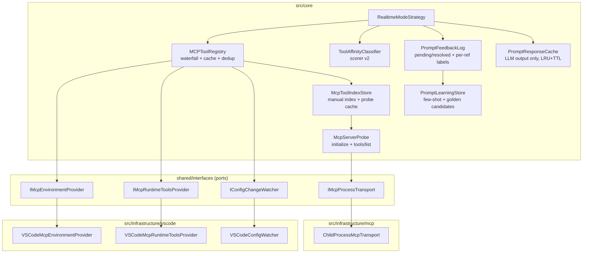
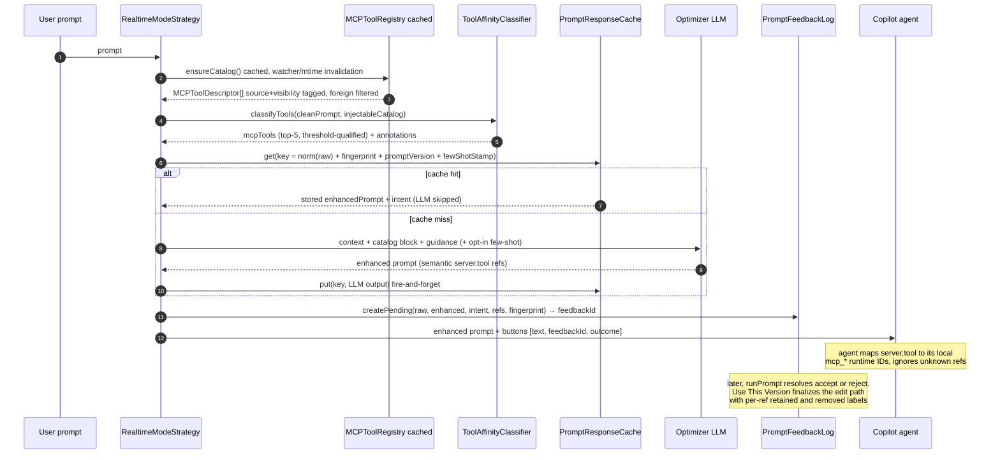

# Plan: MCP-Aware Tool Provisioning v2 (Enhancement 4 redesign)

> **Status:** Supersedes phases 4a–4c of [plan-promptbooster-mcp-awareness.md](../plan-promptbooster-mcp-awareness.md).
> **Reference spec:** [promptbooster-enhancement-spec.md](../promptbooster-enhancement-spec.md) — Enhancement 4.
> **v2.1 amendment:** Phase E redesigned from observed-`toolCalls` "effectiveness" logging to **acceptance-based feedback + optimizer response cache + learning/promotion** (user-approved change request). See the Phase E design block in section 2 and the deviations note in section 6.
> **Architect output — no business logic implemented here.** Hand off to `developer`.

---

## 1. Problem summary (review findings)

| # | Finding | One-line restatement |
|---|---|---|
| F1 | Catalog is empty in practice | Tool descriptors are only built from rare inline `tools: [...]` config schemas; real config files carry only `command/args/env`, so ~95% of users get a 0-tool catalog and Enhancement 4 is a silent no-op. |
| F2 | Cross-agent tool mismatch | Tools discovered from Claude Desktop / Cursor / Cline configs are injected into prompts for the VS Code Copilot agent, which cannot execute them → wasted agent turns probing nonexistent tools; reference format `server.tool` also does not match Copilot's `mcp_`-prefixed runtime IDs. |
| F3 | Scorer precision | `promptLower.includes(word)` substring matching, no stopwords, `len > 3` admitting generic words, and raw match counts favoring long generic descriptions produce false-positive inline tool refs that cost agent turns. |
| F4 | Secondary issues | Per-request re-read + JSON.parse of all sources (incl. multi-MB `~/.claude.json`); silent first-source-wins dedup across conflicting configs; no effectiveness measurement (functional success criteria only). |

**Pre-existing defects discovered during review (fixed as part of v2):**

- `src/core/services/MCPToolRegistry.ts` imports `vscode` directly (line 22) — violates the "never import `vscode` in `src/core/**`" rule.
- `src/test/core/MCPToolRegistry.test.ts` builds mocks keyed on `/mock/workspace/...` while the registry reads real `vscode.workspace.workspaceFolders` paths — tests are environment-dependent.
- `src/test/core/ToolAffinityClassifier.test.ts` test "matches enabled MCP tool by description keyword" asserts a match that the current substring scorer cannot produce (no description word is a substring of the prompt). The suite on this branch is suspect; Phase D rewrites these cases.

---

## 2. Target architecture

### Components and responsibilities

| Component | Layer | Responsibility |
|---|---|---|
| `MCPToolRegistry` (modified in place) | core | Orchestrates the discovery waterfall over **provider ports**, caches the catalog with fingerprint + watcher invalidation, tags every descriptor with `source`/`visibility`/`origin`, dedups with conflict logging. **No `vscode` import after refactor.** |
| `McpToolIndexStore` (new) | core | Loads/saves the persisted, user-editable tool index (`.vscode/promptbooster-mcp-tools.json`) and the probe cache (via `IStateRepository`), with fingerprints + TTLs. |
| `McpServerProbe` (new) | core | JSON-RPC `initialize` + `tools/list` handshake logic against a stdio transport. Pure protocol logic — testable with a mock transport. Never invoked on the synchronous enhance path. |
| `ToolAffinityClassifier` (modified) | core | Scorer v2: tokenization, stopwords, crude stemming, distinct-token weighting, length normalization, whole-word name bonus, qualification threshold, deterministic top-5. |
| `PromptFeedbackLog` (new) | core | Replaces the withdrawn `McpEffectivenessLog`. Records explicit user decisions (accept / reject / edit) captured from the existing chat UI buttons, plus the final edited text on the edit path; derives per-ref retained/removed labels; pending + resolved ring buffers in workspace state (via `IStateRepository`). |
| `PromptResponseCache` (new) | core | Caches **only** the optimizer LLM output, keyed by normalized raw prompt + catalog fingerprint + optimizer-prompt version stamp (+ few-shot stamp). LRU cap + TTL in workspace state — never a committable file; miss/stale/corrupt always degrades to the normal path. |
| `PromptLearningStore` (new) | core | Promotes confirmed-positive pairs (verbatim accepts, refs-retained-after-edit) to bounded opt-in few-shot examples and on-demand golden-set candidates. Never promotes rejections; workspace-scoped. |
| `VSCodeMcpEnvironmentProvider` (new adapter) | infrastructure | Supplies workspace path, `mcp.servers` settings, disabled-server set, homedir — the facts the registry used to get from `vscode` directly. |
| `VSCodeMcpRuntimeToolsProvider` (new adapter) | infrastructure | Capability-checked access to `vscode.lm.tools` (proposed API guarded by `typeof`/`in` checks + try/catch); maps `mcp_`-prefixed runtime tool names back to `serverName`/`toolName`. |
| `ChildProcessMcpTransport` (new adapter) | infrastructure | `child_process.spawn` of a stdio MCP server, JSON-RPC framing, hard timeout + kill. `env` is passed through but **never logged**. |
| `VSCodeConfigWatcher` (new adapter) | infrastructure | `workspace.createFileSystemWatcher` over the known config paths + `onDidChangeConfiguration` for `mcp.*` / `promptBooster.mcp.*`; exposes a plain callback event. Disposed into `context.subscriptions`. |
| `RealtimeModeStrategy` (modified) | core | Calls `registry.ensureCatalog()` (cached) instead of `discover()`; filters catalog by visibility; consults `PromptResponseCache` immediately in front of the optimizer LLM call; creates the pending `PromptFeedbackLog` record at render time and routes button arguments through its feedbackId; still records best-effort feature-detected `request.toolCalls`; renders source-annotated MCP tags. `IModeStrategy` contract unchanged. |

### Discovery waterfall (v2)

```
Priority (highest wins on dedup):
  0. vscode-runtime    — vscode.lm.tools via adapter  → REAL descriptions, REAL injectable names   ← PRIMARY
  1. probe-cache       — cached opt-in tools/list handshake results (fresh per fingerprint+TTL)
  2. manual-index      — user-editable .vscode/promptbooster-mcp-tools.json                      ← persists probe output
  3. inline-schema     — config files that embed tools: [...] (today's behavior, kept, known-rare)
  4. server-stub       — server registered but no tools known → NOT injectable; name-level data only
```

Failure behavior per level: 0 unavailable/not-proposed → fall through silently; 1 stale/absent → fall through; 2 malformed JSON → log warn, ignore file; 3 unchanged from today; 4 contributes no injectable descriptors. Empty final catalog → Enhancement 1–3 behavior is byte-identical (existing invariant, kept and tested).





### Phase E design — feedback, response cache, and learning loop (v2.1)

**Why the redesign:** the observed side of the old `McpEffectivenessLog` design (`request.toolCalls`) has no reliable ground truth — it is feature-detect-at-best in the current VS Code chat API. The golden set also cold-starts at ~20 hand-labeled prompts, and every enhance pays full optimizer-LLM latency even for repeated prompts. Phase E therefore measures what the UI already knows for certain: **which text the user chose**.

**Capture points (all pre-existing UI; no new chat-API dependencies):**

| User action (existing button) | Command invoked today | v2.1 capture |
|---|---|---|
| Apply to Chat / Ask in Chat | `promptBooster.runPrompt(optimized)` | `runPrompt(optimized, feedbackId, "accept")` — verbatim acceptance, **weak positive** |
| Use Original | `promptBooster.runPrompt(original)` | `runPrompt(original, feedbackId, "reject")` — **negative** |
| Refine in File / Edit | `promptBooster.createPromptFile(original, optimized)` | `createPromptFile(original, optimized, feedbackId)` — outcome `edit-opened`; the generated file's header carries the id |
| Use This Version (new) | — | `promptBooster.usePromptVersion` — outcome `edit-finalized` with the final text (**strong positive** per retained ref) |

Record lifecycle: `pending` (created in `RealtimeModeStrategy` right after a successful optimize, before rendering) → one of `accept` / `reject` / `edit-opened`; `edit-opened` later upgrades to `edit-finalized`. All command-argument additions are **trailing and optional** — the commands keep working when invoked without them (no feedback recorded, graceful).

**Record shape** (`PromptFeedbackRecord` in `shared/types/PromptFeedbackTypes.ts`, stub created): `feedbackId`, `rawPrompt`, `enhancedPrompt`, `intent`, `builtinToolTags[]`, `mcpRefs[]` (qualifiedNames), `outcome`, `catalogFingerprint`, `timestamp`, `finalText?`, `observedToolCalls?` (best-effort, feature-detected — kept from v2).

**Per-ref label semantics** (pure derivation, unit-tested as written):

| Outcome | Per-injected-ref label |
|---|---|
| `edit-finalized` | retained iff `finalText` contains the `qualifiedName` **or** contains both `serverName` and `toolName` → `retained-strong`; else `removed` |
| `accept` | all injected refs → `retained-weak` (prompt-level signal only; per-ref unknowable) |
| `reject` | all injected refs → `removed` |
| `edit-opened` / `pending` at TTL expiry | no per-ref label (funnel-only) |

**Edit-path capture affordance (closes the "final text never observed" gap):**

1. `FileModeStrategy.generatePromptFile(original, optimized, feedbackId?)` (additive optional param) embeds a `PromptBooster-Feedback-Id: <uuid>` line inside the existing leading HTML comment of the generated file.
2. New command `promptBooster.usePromptVersion` ("PromptBooster: Use This Prompt Version"): reads the document it is invoked on, extracts the id with `/^PromptBooster-Feedback-Id:\s*(\S+)\s*$/m` over the leading comment block, computes `finalText` by stripping HTML comments (identical rule to `FileModeStrategy.processPromptFile`), calls `feedbackLog.finalizeEdit(feedbackId, finalText)` (per-ref labels derived there), then sends `finalText` to chat with clipboard fallback — i.e. it is the edit path's real "apply" affordance, not pure telemetry.
3. Surfacing: `PromptFileCodeLensProvider` gains a second lens ("✓ Use This Version", command `promptBooster.usePromptVersion`, argument = the document) for any `.prompt.md` whose leading comment contains the feedback header, **regardless of operation mode** (the refine-in-file flow starts from chat/realtime mode; the existing "Process" lens keeps its file-mode-only gate). The generated file's trailing instruction comment mentions it.
4. Justification vs. alternatives: CodeLens + contributed command + in-file comment metadata are stable APIs this repo already uses (`PromptFileCodeLensProvider`, `processPromptFile`). File-save/close heuristics cannot distinguish abandonment from completion; a status-bar button is mode-gated and not file-scoped. The cost of requiring an explicit click is self-selection — made visible in the report funnel (rendered → decision → edit-finalized), never hidden.

**Response cache (Phase E2):**

```
cacheKey = sha256(
  [
    "pb-cache-v1",                        // key-schema version; bump when the formula itself changes
    normalizeWhitespace(rawPrompt),       // trim + collapse \s+ to " "; NOT lowercased (conservative)
    catalogFingerprint,                   // registry v2 fingerprint (path+mtimeMs+size + watcher
                                          //   version), via new additive MCPToolRegistry.getCatalogFingerprint()
    OPTIMIZER_PROMPT_VERSION,             // exported const in core/prompts/SystemPrompts.ts;
                                          //   bumped manually on any optimizer-prompt change
    fewShotStamp,                         // "" when few-shot is off; else sha256 of selected examples
  ].join(String.fromCharCode(0))          // NUL separator: cannot occur in normalized prompt text
)
```

- Cached value: `CachedPromptResponse { enhancedPrompt, intent, createdAt, hitCount }` — **the optimizer LLM output only**. Everything deterministic (workspace preamble, reference resolution, classification, current-catalog filtering) re-runs on every request; the scorer is < 1 ms, so a hit skips exactly one LLM round-trip and nothing else in `execute()` changes. The cache sits immediately in front of the `optimizer.optimizeStructured` call (inside the existing timeout race).
- Storage: workspace state via `IStateRepository` (single namespaced key, ordered entry list, LRU eviction at `promptBooster.cache.maxEntries`, lazy TTL expiry at `promptBooster.cache.ttlDays`). Never a file — prompts may contain secrets. Corrupt payload ⇒ treated as empty (miss), never thrown.
- Failure posture: `get()` never throws; `put()` is fire-and-forget with a logged `.catch`; disabled (`promptBooster.cache.enabled: false`) ⇒ always miss, put no-op. Cache behavior must never be observable as an enhance failure.
- Known approximation: workspace context / resolved references are intentionally not part of the key, so a hit within the TTL may reflect slightly stale context. Accepted: identical raw prompt + identical catalog + identical optimizer version is a high-fidelity match for the LLM *transformation*; TTL + LRU bound the drift (risk table, section 9).

**Learning / promotion (Phase E3):**

- Confirmed positives = resolved records with outcome `accept` (retainedRefs = all injected refs, weak) or `edit-finalized` (retainedRefs = retained subset, strong). Rejections and unresolved records are **never** promoted. Everything is workspace-scoped (workspace state); nothing crosses workstations.
- (a) Few-shot: `PromptLearningStore.getFewShotExamples()` returns the most recent confirmed pairs, deduped by normalized raw prompt, capped by `promptBooster.learning.maxFewShotExamples` (5) and a total char budget `promptBooster.learning.fewShotCharBudget` (2000). **Opt-in, default OFF** (`promptBooster.learning.fewShotFromFeedback`) — accepted prompts are re-sent to the model provider, a privacy decision the user must make explicitly. Rendered through a template in `core/prompts/` (data, not logic). The selection is prompt-independent (recent workspace-level list), so the `fewShotStamp` — and therefore the cache key — changes only when new feedback arrives.
- (b) Golden-set candidates: `promptBooster.exportMcpGoldenCandidates` writes `{ prompt, expectedTools }[]` entries (from confirmed positives with ≥ 1 retained MCP ref; `expectedTools` = retained refs) to a user-chosen file via Save dialog. Maintainers curate and merge into `src/test/fixtures/mcp-golden-prompts.json` — a human gate, never auto-promoted. This is the cold-start fix for the ~20-prompt golden set.

**Reporting:** `promptBooster.showFeedbackReport` (replaces the never-implemented `promptBooster.showMcpReport`) prints to the PromptBooster output channel: outcome funnel counts, acceptance rate = `accept / (accept + reject)`, per-ref retention rate = `retained / (retained + removed)` over edit-finalized records, cache hit rate, and observed-toolCalls precision when observations exist (labeled best-effort).

**Settings (exact names + defaults, added to `package.json`):**

| Setting | Type | Default | Purpose |
|---|---|---|---|
| `promptBooster.feedback.enabled` | boolean | `true` | Master switch for decision capture (workspace-local only). |
| `promptBooster.feedback.historyLimit` | number | `200` | Resolved-record ring cap. |
| `promptBooster.cache.enabled` | boolean | `true` | Optimizer response cache. |
| `promptBooster.cache.ttlDays` | number | `7` | Entry re-validation window. |
| `promptBooster.cache.maxEntries` | number | `200` | LRU cap. |
| `promptBooster.learning.fewShotFromFeedback` | boolean | `false` | Opt in: send confirmed-accepted prompts back as few-shot examples. |
| `promptBooster.learning.maxFewShotExamples` | number | `5` | Example count cap. |
| `promptBooster.learning.fewShotCharBudget` | number | `2000` | Total char budget for the few-shot block. |

All read through one additive method `IConfigurationManager.getFeedbackLearningOptions(): { feedbackEnabled; historyLimit; cacheEnabled; cacheTtlDays; cacheMaxEntries; fewShotFromFeedback; maxFewShotExamples; fewShotCharBudget }`.

**Layering:** no new `shared/interfaces` port is required. The capture points are presentation-side (`ChatCommandsHandler`, `UsePromptVersionCommand`) and depend on the core services through their interfaces (`IPromptFeedbackLog`, `IPromptResponseCache`, `IPromptLearningStore`, defined alongside the services per the `IPromptOptimizationService` convention) via constructor injection; persistence flows through the existing `IStateRepository` port; the only `vscode` API use (CodeLens, active editor, Save dialog, output channel) stays in `src/presentation/**`, which may import `vscode`. Core stays vscode-free.

---

## 3. Decision record

**Primary discovery path: (a) runtime discovery via `vscode.lm.tools`, behind `IMcpRuntimeToolsProvider`.**

Rationale: it is the only source that simultaneously fixes F1 and F2 — it returns *actual* tool descriptions for tools the downstream Copilot agent can really execute, including VS Code-registered MCP servers regardless of which config file declared them, and it exposes the real runtime tool names (`mcp_...`) so reference steering can be calibrated. It costs zero process spawns and zero extra latency beyond one cached call. It is a proposed API, so access is wrapped behind a port with a capability check; unavailability degrades cleanly to the fallback chain.

**Secondary: (c) persisted user-editable tool index (`.vscode/promptbooster-mcp-tools.json`), seeded by (b) the opt-in cached probe.**
The probe (`initialize` + `tools/list` over stdio) is the only way to get real descriptions for servers not visible to `vscode.lm.tools` (e.g. foreign-editor configs, or runtime API unavailable). Because it spawns user-configured processes it must be: **opt-in** (`promptBooster.mcp.probeServers`, default `false`), **hard-timeboxed** (2s init / 3s list / 6s kill), **never on the enhance path** (background on activation, on config change, or on the explicit `promptBooster.refreshMcpIndex` command), and **cached** in workspace state keyed by `command+args` fingerprint with a 24h TTL. The manual index is the durable artifact: the refresh command merges runtime + probe results into the JSON file, which the user can edit (fix descriptions, delete noise) and commit.

**Tertiary: existing config-file parsing stays** (now correctly understood as producing mostly server stubs + rare inline schemas), and remains the source of record for server *names* and enablement.

**Rejected alternatives:**
- *Probe on by default, in-request* — spawns user processes during a chat turn; latency, surprise, and secret-env risk. Rejected as default; kept as opt-in background.
- *LLM-guessing tool names from server names* ("postgres-mcp probably has query_db") — hallucinated tool refs cause exactly the wasted-turn failure F2 warns about. Rejected.
- *Foreign-agent configs as the primary catalog* — tools the target agent cannot execute; now demoted to `visibility: "foreign"` (see F2 fix).
- *`~/.claude.json` streaming parse* — unnecessary once discovery is cached; a 5 MB size cap + skip covers the pathological case.

**F2 decisions:** target agent is fixed to VS Code Copilot agent mode (the only downstream agent this extension serves; the chat participant runs in VS Code). Visibility policy table, keyed by `McpConfigSource`:

| source | visibility | default injection |
|---|---|---|
| `vscode-runtime`, `vscode-workspace`, `vscode-settings`, `github-copilot` | `injectable` | yes |
| `manual-index`, `probe-cache` | `injectable` | yes (user-curated/opt-in by construction) |
| `claude-desktop`, `claude-code-global`, `claude-code-workspace`, `cursor`, `cline` | `foreign` | no; `promptBooster.mcp.includeForeignServers` (default `false`) opts in, annotating refs "other-editor tool — only use if available here" |

Reference-format fidelity: `formatForSystemPrompt()` guidance is reworded to state explicitly that `server.tool` names are **semantic identifiers from the user's MCP configuration**, that the agent resolves them to its locally registered tools (which may use different runtime IDs such as `mcp_…`), and that the agent must **ignore** a reference it cannot resolve rather than probing for it.

**F4 decisions:** caching via fingerprint (`path + mtimeMs + size` per source file, plus a watcher-bumped version) with stale-while-revalidate (return cached immediately, refresh in background; only the very first call awaits discovery); 5 MB parse cap per file; dedup keeps the documented priority order but records **all** sources on the descriptor and logs a warning when colliding servers have different normalized `command+args`. Effectiveness: **acceptance-based feedback** — the chat UI's existing buttons (Apply/Ask = verbatim accept, Use Original = reject, Refine/Edit = edit path, closed by the new "Use This Version" affordance) are the ground truth, recorded in workspace state; observed `request.toolCalls` remains a best-effort side channel (Phase E design block, section 2). Efficiency: the optimizer LLM output is cached per normalized raw prompt + catalog fingerprint + optimizer-prompt version stamp (workspace state, LRU + TTL, fire-and-forget); deterministic stages always re-run. A deterministic ~20-prompt golden-set unit test remains, growable via exported candidates (sections 9–10).

---

## 4. File list

### Add

| File | What |
|---|---|
| `src/shared/types/McpToolTypes.ts` | Canonical `MCPToolDescriptor` (with `source`, `visibility`, `sources[]`, `origin`), `McpConfigSource`, `ToolVisibility`. Single source of truth; ends the current registry/classifier duplication. |
| `src/shared/interfaces/IMcpEnvironmentProvider.ts` | Port: workspace path, `mcp.servers` settings, disabled set, homedir. *(stub created)* |
| `src/shared/interfaces/IMcpRuntimeToolsProvider.ts` | Port: capability-checked `vscode.lm.tools` listing. *(stub created)* |
| `src/shared/interfaces/IMcpProcessTransport.ts` | Port: stdio JSON-RPC `tools/list` handshake. *(stub created)* |
| `src/shared/interfaces/IConfigChangeWatcher.ts` | Port: config-change callback + `dispose()`. *(stub created)* |
| `src/core/services/McpToolIndexStore.ts` | Manual index load/save + probe cache (via `IStateRepository` + `IFileSystem`). |
| `src/core/services/McpServerProbe.ts` | Protocol logic over `IMcpProcessTransport` (initialize handshake, tools/list, timeout enforcement). |
| `src/shared/types/PromptFeedbackTypes.ts` | Canonical `PromptFeedbackRecord`, `PromptFeedbackOutcome`, `McpRefLabel`, `ConfirmedPromptPair`, `CachedPromptResponse` (Phase E redesign). *(stub created)* |
| `src/core/services/PromptFeedbackLog.ts` | Pending/resolved feedback records, per-ref label derivation, report aggregation (via `IStateRepository`). Replaces the withdrawn `McpEffectivenessLog`. |
| `src/core/services/PromptResponseCache.ts` | Optimizer-LLM-output cache: key formula, LRU + TTL, corrupt-state tolerance (via `IStateRepository`). |
| `src/core/services/PromptLearningStore.ts` | Confirmed-positive selection, bounded opt-in few-shot examples, golden-set candidate export. |
| `src/presentation/commands/UsePromptVersionCommand.ts` | Edit-path completion: extract feedback id from the prompt-file header, finalize with the edited text, send to chat. |
| `src/presentation/commands/ShowFeedbackReportCommand.ts` | Renders the feedback/cache report to the PromptBooster output channel. |
| `src/presentation/commands/ExportMcpGoldenCandidatesCommand.ts` | Writes golden-set candidates via Save dialog for maintainer curation. |
| `src/infrastructure/vscode/VSCodeMcpEnvironmentProvider.ts` | Adapter for `IMcpEnvironmentProvider`. |
| `src/infrastructure/vscode/VSCodeMcpRuntimeToolsProvider.ts` | Adapter for `IMcpRuntimeToolsProvider` (guarded proposed-API access). |
| `src/infrastructure/vscode/VSCodeConfigWatcher.ts` | Adapter for `IConfigChangeWatcher`. |
| `src/infrastructure/mcp/ChildProcessMcpTransport.ts` | Adapter for `IMcpProcessTransport` (spawn, frame, timeout-kill). |
| `src/presentation/commands/RefreshMcpIndexCommand.ts` | Runs probe + runtime merge, writes the manual index file. |
| `src/test/mocks/MockMcpEnvironmentProvider.ts`, `MockConfigChangeWatcher.ts`, `MockMcpProcessTransport.ts`, `MockStateRepository.ts` | Test doubles (or appended to `MockServices.ts` — developer's choice, keep one convention). |
| `src/test/core/McpServerProbe.test.ts`, `McpToolIndexStore.test.ts`, `PromptFeedbackLog.test.ts`, `PromptResponseCache.test.ts`, `PromptLearningStore.test.ts` | New unit tests. |
| `src/test/fixtures/mcp-golden-prompts.json` | ~20 labeled prompts → expected tool(s) (may be `[]`). |
| `src/test/core/McpGoldenSet.test.ts` | Precision/recall harness over the golden set. |

### Modify

| File | What |
|---|---|
| `src/core/services/MCPToolRegistry.ts` | Remove `vscode`/`os` ambient use → ports; add source/visibility/origin tagging; add `ensureCatalog()` + fingerprint cache + watcher invalidation + 5 MB parse cap; dedup conflict logging; wire runtime provider, index store, probe cache; updated `formatForSystemPrompt()` wording (semantic-reference note; sanitized, length-capped descriptions); additive `getCatalogFingerprint(): string` for feedback/cache keying. |
| `src/core/services/ToolAffinityClassifier.ts` | Import descriptor from `shared/types/McpToolTypes.ts`; scorer v2 (section 7); keep signature `classifyTools(prompt, mcpCatalog?)` and `ToolAffinityResult` shape. |
| `src/core/strategies/RealtimeModeStrategy.ts` | `ensureCatalog()` instead of `discover()`; visibility filtering before classify; create pending feedback record post-optimize and render buttons with `[text, feedbackId, outcome]` arguments; cache in front of the optimizer call; opt-in few-shot block appended to optimizer input; best-effort feature-detected `request.toolCalls` → `PromptFeedbackLog`; render MCP tags with source annotation; MCP block stays fully guarded by "non-empty catalog". |
| `src/presentation/commands/ChatCommands.ts` | `runPrompt(prompt, feedbackId?, outcome?)` resolves accept/reject and `createPromptFile(original, optimized, feedbackId?)` marks `edit-opened` — trailing optional args via injected `IPromptFeedbackLog`, fire-and-forget (failures logged, never surfaced to the user). |
| `src/core/strategies/FileModeStrategy.ts` | `generatePromptFile(original, optimized, feedbackId?)` embeds `PromptBooster-Feedback-Id:` in the leading header comment; trailing instruction comment mentions "Use This Version". Additive optional param — existing callers/tests unaffected. |
| `src/presentation/ui/ProcessButton.ts` | `PromptFileCodeLensProvider` adds the mode-agnostic "Use This Version" lens for feedback-tagged `.prompt.md` files (argument = document). Existing "Process" lens and its file-mode gate unchanged. |
| `src/core/prompts/SystemPrompts.ts` | Export `OPTIMIZER_PROMPT_VERSION = "1"` + the few-shot example template block (data-only). |
| `src/shared/interfaces/IFileSystem.ts` + `src/infrastructure/vscode/VSCodeFileSystem.ts` | Additive `stat(path): Promise<{ mtimeMs: number; size: number } | undefined>` (fingerprinting). Additive — no existing caller breaks. |
| `src/shared/interfaces/IConfigurationManager.ts` + `src/infrastructure/config/ConfigurationManager.ts` + `src/test/mocks/MockServices.ts` | Additive `getMcpProvisioningOptions(): { probeServers: boolean; includeForeignServers: boolean; cacheTtlMinutes: number }` reading new `promptBooster.mcp.*` settings, and additive `getFeedbackLearningOptions()` reading `promptBooster.feedback.*` / `.cache.*` / `.learning.*` (Phase E design block). Update `MockConfigurationManager` for both. |
| `src/di/types.ts`, `src/di/ServiceRegistry.ts` | New symbols + registrations (section 5); `RealtimeModeStrategy` and `ChatCommandsHandler` factories gain resolves. |
| `src/extension.ts` | Warm catalog on activation (fire-and-forget, never blocking); register watcher `dispose()` in `context.subscriptions`; register `promptBooster.refreshMcpIndex` / `promptBooster.usePromptVersion` / `promptBooster.showFeedbackReport` / `promptBooster.exportMcpGoldenCandidates` commands. |
| `package.json` | New settings `promptBooster.mcp.probeServers` (false), `.includeForeignServers` (false), `.cacheTtlMinutes` (10), plus `promptBooster.feedback.*` / `.cache.*` / `.learning.*` (Phase E design block table); command contributions incl. the three Phase E commands. |
| `src/test/core/MCPToolRegistry.test.ts` | Inject `MockMcpEnvironmentProvider` (hermetic — no ambient workspace); retest waterfall, dedup conflicts, visibility gating, cache invalidation, size cap. |
| `src/test/core/ToolAffinityClassifier.test.ts` | Rewrite MCP cases for scorer v2, incl. the currently-impossible "matches by description keyword" case. |
| `src/test/core/strategies/RealtimeModeStrategy.test.ts` | Mock registry exposes `ensureCatalog()`; add "empty catalog ⇒ prompt identical to Enhancements 1–3" assertion; new Phase E cases per section 8. |
| `src/test/mocks/MockServices.ts` | `MockMCPToolRegistry` gets `ensureCatalog()` + `getInjectableCatalog()` + `getCatalogFingerprint()`; `MockFileSystem` gets `stat()`; `MockConfigurationManager` gets both new option methods; new `MockPromptFeedbackLog`, `MockPromptResponseCache`, `MockLearningStore` for the strategy's added dependencies. |

### Delete

None.

---

## 5. Interfaces and DI wiring (explicit)

**New `TYPES` symbols in `src/di/types.ts`:**

```ts
// Infrastructure adapters
McpEnvironmentProvider:  Symbol.for("IMcpEnvironmentProvider"),
McpRuntimeToolsProvider: Symbol.for("IMcpRuntimeToolsProvider"),
McpProcessTransport:     Symbol.for("IMcpProcessTransport"),
ConfigChangeWatcher:     Symbol.for("IConfigChangeWatcher"),
// Core services
McpToolIndexStore:       Symbol.for("IMcpToolIndexStore"),
McpServerProbe:          Symbol.for("IMcpServerProbe"),
PromptFeedbackLog:       Symbol.for("IPromptFeedbackLog"),
PromptResponseCache:     Symbol.for("IPromptResponseCache"),
PromptLearningStore:     Symbol.for("IPromptLearningStore"),
// Presentation
RefreshMcpIndexCommand:  Symbol.for("RefreshMcpIndexCommand"),
UsePromptVersionCommand:      Symbol.for("UsePromptVersionCommand"),
ShowFeedbackReportCommand:    Symbol.for("ShowFeedbackReportCommand"),
ExportMcpGoldenCandidatesCommand: Symbol.for("ExportMcpGoldenCandidatesCommand"),
```

**`ServiceRegistry` registrations:**

- `registerInfrastructure`: `McpEnvironmentProvider → new VSCodeMcpEnvironmentProvider()`; `McpRuntimeToolsProvider → new VSCodeMcpRuntimeToolsProvider(logger)`; `McpProcessTransport → new ChildProcessMcpTransport(logger)`; `ConfigChangeWatcher → new VSCodeConfigWatcher()` (all singletons).
- `registerCoreServices`:
  - `McpToolRegistry` (existing symbol, **modified factory**): `new MCPToolRegistry(fs, logger, envProvider, runtimeToolsProvider, indexStore, configWatcher, configManager)` where `indexStore = new McpToolIndexStore(fs, stateRepository, logger)`.
  - `McpServerProbe → new McpServerProbe(transport, logger)`.
  - `PromptFeedbackLog → new PromptFeedbackLog(stateRepository, configManager, logger)`; `PromptResponseCache → new PromptResponseCache(stateRepository, configManager, logger)`; `PromptLearningStore → new PromptLearningStore(c.resolve(TYPES.PromptFeedbackLog), logger)` (all singletons).
- `registerStrategies`: `RealtimeModeStrategy` factory appends `c.resolve(TYPES.PromptFeedbackLog)`, `c.resolve(TYPES.PromptResponseCache)`, `c.resolve(TYPES.PromptLearningStore)` (registry dependency unchanged symbolically; the strategy test's constructor list grows accordingly — mocks updated in the same change).
- `registerPresentationLayer`: `RefreshMcpIndexCommand → new RefreshMcpIndexCommand(registry, probe, indexStore, configManager, logger)`; `ChatCommandsHandler` factory appends `c.resolve(TYPES.PromptFeedbackLog)` (third constructor arg); `UsePromptVersionCommand → new UsePromptVersionCommand(feedbackLog, logger)`; `ShowFeedbackReportCommand → new ShowFeedbackReportCommand(feedbackLog, responseCache, learningStore, logger)`; `ExportMcpGoldenCandidatesCommand → new ExportMcpGoldenCandidatesCommand(learningStore, logger)`.

Constructor injection only — no `container.resolve()` inside services (existing convention).

**Interface stubs created by the architect** (shape only, developer finalizes JSDoc/edge cases): `IMcpEnvironmentProvider.ts`, `IMcpRuntimeToolsProvider.ts`, `IMcpProcessTransport.ts`, `IConfigChangeWatcher.ts`, plus `shared/types/McpToolTypes.ts` and `shared/types/PromptFeedbackTypes.ts`. The Phase E service interfaces (`IPromptFeedbackLog`, `IPromptResponseCache`, `IPromptLearningStore`) are defined alongside their services by the developer (repo convention, cf. `IPromptOptimizationService.ts`) — no new `shared/interfaces` port is needed (rationale in the Phase E design block, section 2).

---

## 6. Ordered task list (developer)

**Phase A — Ports + hermetic foundations (no behavior change)**
1. Add `stat()` to `IFileSystem` + `VSCodeFileSystem` + `MockFileSystem`.
2. Add `getMcpProvisioningOptions()` to `IConfigurationManager` + `ConfigurationManager` + `MockConfigurationManager`; add settings to `package.json`.
3. Create `shared/types/McpToolTypes.ts` and the four interface stubs (section 5).
4. Create infrastructure adapters + `TYPES` symbols + registrations (adapters may be trivially thin at this point).
5. Compile + lint + test green (no functional change yet).

**Phase B — Registry v2 (F1 partial, F4 caching/dedup, layering fix)**
6. Refactor `MCPToolRegistry` to consume ports; delete its `vscode` import. Behavior-preserving for inline schemas.
7. Add source/visibility/origin tagging, dedup-conflict warning, 5 MB parse cap, `ensureCatalog()` with fingerprint + watcher invalidation + stale-while-revalidate.
8. Rewrite `MCPToolRegistry.test.ts` hermetically (mock env provider); keep all existing behavioral assertions that are still valid (dedup first-wins, disabled/empty-command exclusion, empty-catalog graceful path).
9. Update `MockMCPToolRegistry` + `RealtimeModeStrategy` to `ensureCatalog()`; update strategy test with the identical-output-when-empty assertion.

**Phase C — Real tool acquisition (F1)**
10. Implement `McpServerProbe` (protocol) + `ChildProcessMcpTransport` (spawn/timeout/kill; never log `env`).
11. Implement `McpToolIndexStore`: probe cache (workspace state, `command+args` fingerprint, 24h TTL) + manual index file I/O with defensive parsing.
12. Wire `vscode-runtime` source into the registry waterfall via `VSCodeMcpRuntimeToolsProvider` (capability check; parse `mcp_` runtime names; runtime wins dedup over same-name config entries).
13. Add `RefreshMcpIndexCommand` (+ `package.json` command contribution) and activation warm-up in `extension.ts`.

**Phase D — Scorer v2 + injection gating (F2, F3)**
14. Implement scorer v2 in `ToolAffinityClassifier` (section 7); move descriptor import to `McpToolTypes`.
15. Filter to `injectable` catalog before classify in the strategy; apply foreign-source opt-in annotation.
16. Reword `formatForSystemPrompt()` guidance: semantic identifiers, runtime-ID mapping, ignore-unresolvable; sanitize descriptions (strip control chars/newlines, collapse whitespace, 200-char cap, ~1500-char total budget).
17. Rewrite `ToolAffinityClassifier.test.ts` MCP cases.

**Phase E — Feedback, response cache, and learning (F4 measurement + efficiency; design block in section 2)**

*E1 — Feedback capture (ground truth from real decisions)*
18. Implement `PromptFeedbackLog` (pending → terminal state machine, workspace state via `IStateRepository`, resolved ring cap, lazy pending TTL) + `src/test/core/PromptFeedbackLog.test.ts`.
19. Additive `getFeedbackLearningOptions()` on `IConfigurationManager` + `ConfigurationManager` + `MockConfigurationManager`; `promptBooster.feedback.*` settings in `package.json`.
20. Strategy: after a successful optimize, create the pending record (raw, enhanced, intent, injected tags/refs, catalog fingerprint) → `feedbackId`; render buttons with `[text, feedbackId, outcome]` arguments; attach best-effort feature-detected `request.toolCalls`. Feedback-log failures are caught + logged — the enhance must still render (test with a throwing mock).
21. `ChatCommandsHandler.runPrompt(prompt, feedbackId?, outcome?)` resolves accept/reject; `createPromptFile(original, optimized, feedbackId?)` marks `edit-opened` and threads the id into `FileModeStrategy.generatePromptFile` (leading header comment).
22. `UsePromptVersionCommand` + `promptBooster.usePromptVersion` contribution + "Use This Version" lens in `PromptFileCodeLensProvider` (mode-agnostic, feedback-tagged files only): finalize with the comment-stripped final text, then send it to chat (clipboard fallback).

*E2 — Response cache (efficiency)*
23. Implement `PromptResponseCache` (key formula, LRU + TTL, corrupt-state tolerance, fire-and-forget put) + `src/test/core/PromptResponseCache.test.ts`.
24. Additive `MCPToolRegistry.getCatalogFingerprint()` (+ `MockMCPToolRegistry`); export `OPTIMIZER_PROMPT_VERSION` from `core/prompts/SystemPrompts.ts`; `promptBooster.cache.*` settings.
25. Strategy: the cache sits immediately in front of the `optimizer.optimizeStructured` call (inside the existing timeout race); hit ⇒ LLM skipped and the stored text used verbatim; miss/stale/corrupt/disabled ⇒ normal path + best-effort put. Tests: cached output byte-identical to the stored text; no-regression with the cache empty/disabled.

*E3 — Learning store, promotion, reporting*
26. Implement `PromptLearningStore` (confirmed positives, dedupe, example/char caps, candidate export) + `src/test/core/PromptLearningStore.test.ts`; few-shot template in `core/prompts/`.
27. Strategy appends the few-shot block only when `promptBooster.learning.fewShotFromFeedback` is enabled; the cache key incorporates `fewShotStamp`.
28. `ShowFeedbackReportCommand` (`promptBooster.showFeedbackReport`) + `ExportMcpGoldenCandidatesCommand` (`promptBooster.exportMcpGoldenCandidates`) + registrations in `extension.ts`.

**Design deviations (v2.1 amendment vs. the approved change request):**
- *No new `shared/interfaces` port.* The request allowed "a small new port if needed (e.g. feedback-sink)". It is not needed: the capture points are presentation-side and call the core services through their constructor-injected interfaces; persistence already flows through `IStateRepository`; the only `vscode` API use stays in `src/presentation/**`. A separate feedback-sink port would duplicate `IPromptFeedbackLog` without keeping any `vscode` import out of core.
- *"Use This Version" also sends the prompt to chat*, not just recording the event — otherwise the click is pure telemetry with no user payoff, and adoption (and therefore label volume) would suffer. Mirrors `processPromptFile`'s behavior for consistency.
- *Cache key is whitespace-normalized but not lowercased* — conservative choice: case variants miss rather than risk returning a transform the optimizer would have produced differently.
- *`edit-opened` is recorded when the file is created* (in addition to `edit-finalized`) so the report funnel can show abandonment; the approved design listed the intermediate "edit path" without pinning when it is recorded.
- *Pending records are persisted* (workspace state, lazy TTL) rather than in-memory, so `edit-finalized` still resolves after a window reload — the generated file outlives the session.

**Phase F — Closeout**
29. Full `npm run compile && npm run lint && npm test`; update `docs/architecture_diagrams.md` pointer if desired; flag any deviation back to architect.

Every phase leaves the tree green; Enhancements 1–3 behavior is untouched whenever the catalog resolves empty (guarded at phases 9 and 15 by explicit tests); feedback- and cache-path failures (log throw, cache corrupt/disabled) never break the enhance path (guarded at phases 20 and 25).

---

## 7. Scorer v2 — concrete rules (implementable + testable as written)

```
tokenize(text)        = lowercase(text).match(/[a-z0-9_]+/g) ?? []
normalize(tok)        = tok.length > 4 ? tok.replace(/ies$/,"y").replace(/s$/,"") : tok
                        // "queries"→"query", "tables"→"table", "files"→"file"; both sides normalized
isContentToken(tok)   = tok.length >= 4 && !STOPWORDS.has(tok)

STOPWORDS (starter set, plain data const — extendable without logic changes):
  a, an, the, this, that, these, those, and, or, but, with, from, into, onto, over,
  under, for, to, of, in, on, at, by, as, is, are, was, were, be, been, being, do,
  does, did, can, could, should, would, will, shall, may, might, must, have, has,
  had, i, you, he, she, it, we, they, me, him, her, us, them, my, your, our, their,
  its, not, no, yes, if, then, else, when, what, which, who, how, why, where, all,
  any, some, use, using, used, need, needs, want, please, help, make, made, get,
  got, put, set, via, per, more, most, very, also, just, only, about, after, before,
  between, during, through, against, without, within,
  file, files, code, data, tool, tools, server, servers, mcp
  // generic-in-coding-context words; deliberately excludes verbs like create/run/query/read/write

Per tool:
  descTokens  = unique(tokenize(description).map(normalize).filter(isContentToken))
  promptToks  = new Set(tokenize(prompt).map(normalize))
  matched     = descTokens.filter(t => promptToks.has(t))
  base        = Σ weight(t) for matched   where weight(t) = t.length >= 6 ? 2 : 1
  lengthNorm  = base / sqrt(descTokens.length)          // laundry-list descriptions penalized
  nameBonus   = (wholeWordMatch(serverName) ? 4 : 0)
              + (wholeWordMatch(toolName)   ? 4 : 0)
              // wholeWordMatch: new RegExp("\\b" + escapeRegExp(name) + "\\b") on lowercase prompt;
              // \b treats '-' as a boundary so \bpostgres-mcp\b matches correctly
  final       = lengthNorm + nameBonus
  qualify     = final >= 2.0
Sort: nameBonus desc → final desc → description.length asc (specificity) → qualifiedName asc (determinism)
Keep: top 5 after qualification.
```

Worked examples (lock these as tests):
- desc "Execute SQL queries against the project database", prompt "check the slow query on the dashboard" → matched {query}=1 → 1/2 = 0.5 → **rejected** (precision fix; old test asserted the opposite).
- same desc, prompt "profile the slow query on the project database" → matched {query, project, database} = 1+2+2 = 5 → 5/√4 = 2.5 → **qualified**.
- desc "Read a file from the local filesystem", prompt "fix the bug in this file" → descTokens {read, from?no(stop), local, filesystem}; "file" stopworded; matched {} → **rejected** (the F3 false-positive class).
- prompt "use postgres-mcp to run the slow query" → nameBonus 4 → **qualified, ranked first** regardless of description.
- Long generic desc ("create read update delete files folders tables columns rows everything") vs prompt "query the database": matched {query?…} → tiny `lengthNorm` (big √N divisor) → **rejected** in favor of the focused tool.

Built-in tool scoring (`TOOL_SIGNALS` regexes) is **unchanged** — Enhancement 1 behavior frozen.

---

## 8. Test plan per component

| Component | Tests |
|---|---|
| `MCPToolRegistry` | Hermetic via `MockMcpEnvironmentProvider` + `MockFileSystem`(+`stat`): waterfall priority (runtime > probe-cache > manual-index > inline > stub); visibility tagging per source; foreign excluded from `getInjectableCatalog()`; dedup first-wins + conflict warning on differing commands; disabled/empty-command exclusion; watcher/mtime invalidation; stale-while-revalidate returns cached; 5 MB cap skips parse; empty-catalog graceful path; `formatForSystemPrompt` sanitization + guidance wording. |
| `ToolAffinityClassifier` | All worked examples from section 7; disabled tools never suggested; cap 5; determinism (same input → same order); built-in signals unchanged (existing cases kept); annotations empty when nothing matches. |
| `McpServerProbe` | Mock `IMcpProcessTransport`: happy path maps `tools/list`; initialize failure → empty result; timeout → empty + kill requested; malformed tool entries skipped; `env` never appears in logger calls (assert on MockLogger). |
| `McpToolIndexStore` | Manual index round-trip; malformed JSON ignored with warning; probe-cache fingerprint mismatch → miss; TTL expiry → miss; corruption → empty. |
| `PromptFeedbackLog` | Pending→accept/reject/edit-opened→edit-finalized transitions; terminal outcomes immutable; per-ref labels: qualifiedName-or-both-parts present in `finalText` ⇒ retained, else removed; accept ⇒ all `retained-weak`, reject ⇒ all `removed`; ring cap at `historyLimit`; lazy pending TTL expiry; `finalizeEdit` with unknown/expired id ⇒ no-op; missing state ⇒ empty aggregates; `IStateRepository` throw ⇒ logged, not propagated. |
| `PromptResponseCache` | Whitespace-normalized variants hit; case-differing prompts miss (conservative); catalog-fingerprint / `OPTIMIZER_PROMPT_VERSION` / fewShot-stamp change ⇒ miss; TTL expiry ⇒ miss; LRU cap evicts oldest; corrupt payload ⇒ miss without throwing; disabled ⇒ always miss + put no-op; hits inflate `hitCount` (hit-rate reporting). |
| `PromptLearningStore` | Only `accept` / `edit-finalized` records promoted — rejections and unresolved pendings never; dedupe by normalized rawPrompt (most recent wins); example-count + char-budget caps; `fewShotFromFeedback` off ⇒ zero examples; candidate export shape `{ prompt, expectedTools }` with `expectedTools` = retained refs only. |
| `McpGoldenSet` | ≥ 0.8 precision over `src/test/fixtures/mcp-golden-prompts.json`; prints recall informationally. |
| `RealtimeModeStrategy` | Existing cases updated to `ensureCatalog()` mock; new: catalog empty ⇒ captured optimizer prompt identical to the Enhancements 1–3-only prompt; foreign-only catalog ⇒ no MCP block; pending feedback record created with injected names + fingerprint and buttons carry `[text, feedbackId, outcome]` (assert via captured `stream.button` calls, same mock-stream pattern as today); cache hit ⇒ optimizer mock not called and rendered text equals the stored text byte-for-byte; cache miss ⇒ optimizer called + put invoked; throwing feedback/cache mocks ⇒ enhance still renders; few-shot block present only when the opt-in setting is on (and reflected in the cache-key stamp). |
| Adapters | Thin; covered by compile + one smoke test each at most (`VSCodeMcpRuntimeToolsProvider` capability check returns false when API absent — assert via try/catch path in extension host). Phase E presentation commands (`ChatCommands` arg threading, `UsePromptVersionCommand` header extraction/finalize/send) are vscode-bound — covered by compile plus QA manual checks; the finalize regex and comment-stripping rule are extracted as pure functions exercised in `PromptFeedbackLog.test.ts`. |

Mocks to update: `MockFileSystem` (+stat), `MockConfigurationManager` (+mcp provisioning and feedback-learning options), `MockMCPToolRegistry` (+`ensureCatalog`/`getInjectableCatalog`/`getCatalogFingerprint`), new `MockStateRepository`, `MockMcpEnvironmentProvider`, `MockConfigChangeWatcher`, `MockMcpProcessTransport`, `MockPromptFeedbackLog`, `MockPromptResponseCache`, `MockLearningStore`.

---

## 9. Risks and mitigations

| Risk | Mitigation |
|---|---|
| `vscode.lm.tools` is a proposed/unstable API | Access only through `IMcpRuntimeToolsProvider` with `typeof`/`in` capability checks + try/catch; unavailability degrades to probe/index/config chain. Core never references it. |
| Probe spawns user-configured processes (env may contain secrets) | Opt-in setting (default off), hard timeouts with child kill, background-only execution, `env` passed to the transport but never logged (asserted in tests). |
| Stale catalog after user edits MCP config | File watcher + settings-change listener + mtime/size fingerprint + TTL; stale-while-revalidate so the enhance path never waits. |
| Prompt-injection surface: tool descriptions are third-party untrusted text entering the optimizer prompt | Sanitize (strip control chars/newlines, collapse whitespace), 200-char per-description cap, ~1500-char total budget, guidance says to ignore unresolvable refs. |
| Scorer still mis-ranks on real-world descriptions | Golden-set test gates precision ≥ 0.8; weights/stopwords are plain data — tunable without logic changes; wrong-tool cost bounded by cap 5 and qualification threshold. |
| Multi-root workspaces | First workspace folder only (existing behavior, now documented); noted as a limitation. |
| `IFileSystem.stat` / `IConfigurationManager` additions break external implementers | Repo-internal interfaces only; all implementers (incl. mocks) updated in the same change. |
| Foreign server still desired by some users | `promptBooster.mcp.includeForeignServers` opt-in with explicit "if available" annotation instead of silent exclusion. |
| Probe/index merge conflicts with runtime names | Runtime source wins dedup; manual index entries carry `origin: "manual-index"` and are user-editable by design. |
| Pre-existing red tests on branch (substring scorer, environment-dependent registry tests) | Phases B and D rewrite them hermetically; QA must confirm `npm test` fully green at closeout. |
| Feedback-loop / popularity bias: cached responses and accepted-prompt few-shot examples reinforce past behavior and suppress exploration of better enhancements | Cache TTL (7 days) forces re-validation; deterministic scorer + current-catalog filtering always re-run on every request; few-shot is opt-in, capped (5 examples / 2000 chars) and workspace-scoped; golden-set growth passes a human curation gate. |
| Privacy of stored prompt text (feedback records, cached optimizer output, few-shot examples) | Workspace state only — never a committable file; ring/LRU caps bound retention; few-shot (which re-sends text to the model provider) is opt-in and default OFF; the export command writes only where the user points it. |
| Stale cache reintroducing the F2 dead-ref failure via a non-fingerprinted key | Cache key includes the catalog fingerprint (`path+mtimeMs+size` + watcher version) + `OPTIMIZER_PROMPT_VERSION` + few-shot stamp — any catalog or optimizer-prompt change is a guaranteed miss; corrupt entries degrade to a miss, never an error. |
| Cached output reflects stale workspace context (context/references deliberately not in the key) | Accepted approximation: identical raw prompt + catalog + optimizer version is a high-fidelity match for the LLM *transformation*; TTL + LRU bound drift; the report surfaces hit rate so the trade stays visible. |
| Feedback labels are noisy (Use Original clicked for unrelated reasons; verbatim accept of a no-op enhancement) | Labels carry strength semantics (weak/strong) and feed aggregates and opt-in few-shot only — never automatic config changes; the report funnel (render → decision → edit-finalized) makes self-selection and abandonment visible. |
| Edit-path capture depends on the user clicking "Use This Version" | The command doubles as the edit path's real "apply" affordance (sends to chat), not pure telemetry; non-clicks remain visible as `edit-opened` in the funnel; silent abandonment never produces a false label. |

---

## 10. Revised success criteria (effectiveness-oriented)

1. **Real data:** with ≥ 1 MCP server registered in VS Code (any config file, no inline schemas) and the runtime API available, `ensureCatalog()` yields ≥ 1 tool descriptor with a non-empty description — **without** any inline `tools:` block. (F1 acceptance.)
2. **Precision:** on the ~20-prompt golden set (`src/test/fixtures/mcp-golden-prompts.json`), injected-tool precision ≥ 0.8; recall reported and targeted ≥ 0.6 (secondary). The set is growable over time from exported confirmed-positive candidates (maintainer-curated — cold-start fix).
3. **Target-agent fit:** zero `foreign`-visibility tools injected by default; with the opt-in flag, they carry the "if available" annotation.
4. **No-regression:** with zero resolvable MCP tools, the optimizer input and rendered output are identical to Enhancements 1–3 alone (byte-level assertion in test).
5. **Latency budget:** cached `ensureCatalog()` < 5 ms p95; cold discovery < 150 ms excluding the opt-in probe; the probe never executes on the synchronous enhance path; `classifyTools` < 1 ms.
6. **Field feedback:** `PromptFeedbackLog` records real decisions (accept / reject / edit-opened / edit-finalized) with per-ref retained/removed labels; `promptBooster.showFeedbackReport` surfaces the **acceptance rate** (accept / (accept + reject)) and the **tool-ref retention rate** (retained / (retained + removed) over edit-finalized records) after real use (manual check, not CI-gated). Observed `request.toolCalls` remain a labeled best-effort side channel.
7. **Cache:** the cached path returns exactly the stored optimizer text (byte-identical, CI-asserted); with the cache empty or disabled the enhance path is identical to the uncached path (CI-asserted no-regression); hit rate is reported; a repeated identical prompt within TTL incurs zero optimizer-LLM round-trips.
8. **Hygiene:** `src/core/**` contains no `vscode` import (including `MCPToolRegistry`); `npm run compile && npm run lint && npm test` fully green.

---

## Recommendation

Hand off to the **`developer`** subagent with this plan, starting at Phase A. The phases are ordered so each lands green and Enhancement 1–3 behavior is provably untouched until the MCP path has real data to work with.
